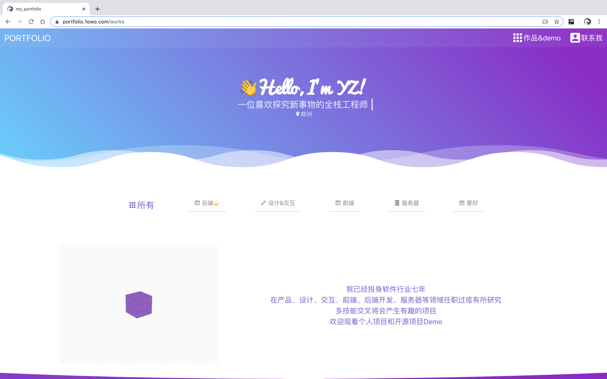
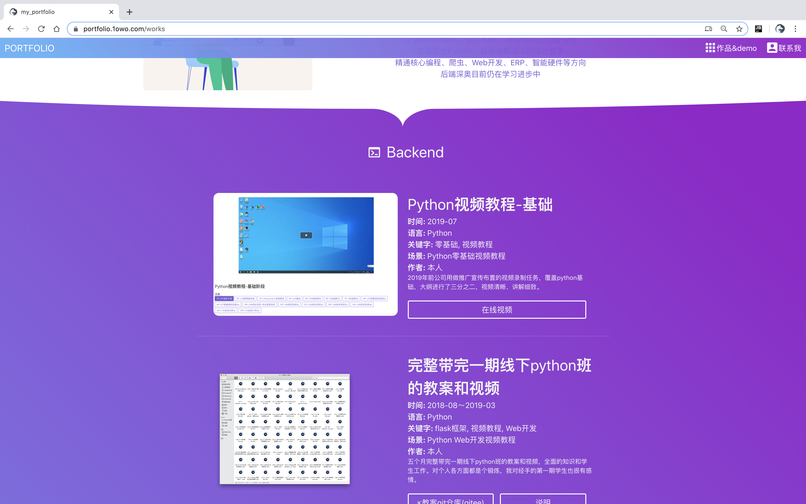
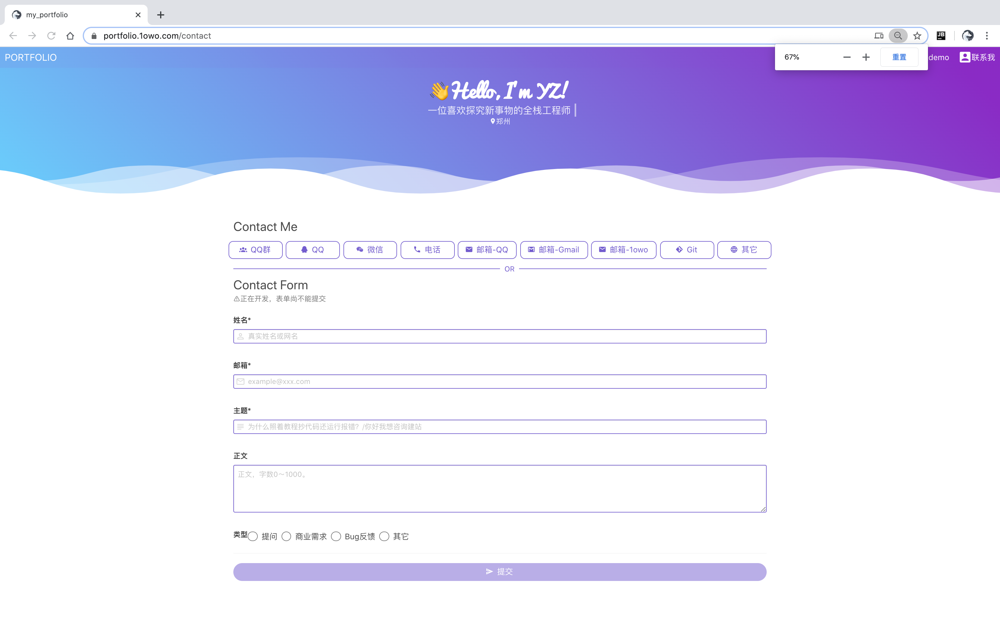
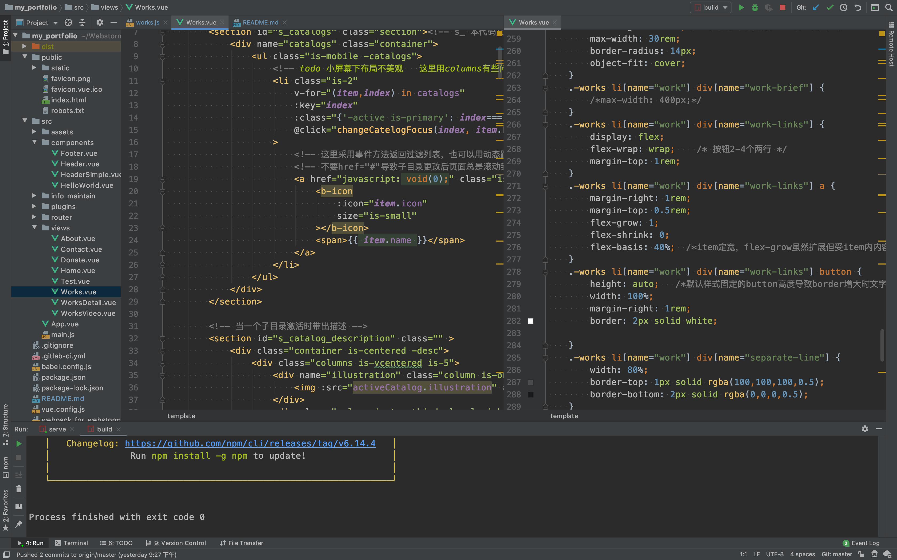

Portfolio 2020
===
## Brief
Status: Obsoleted  
Year: 2020 early  
Code: [repo](https://github.com/zyzypy/portfolio_old)  
Demo: not provided

Introduce:  
I did a portfolio website, cause of several reasons:  
- Summarize and sort out the work of previous years.
- After resignation and under Covid-19 block-down(anti-human) period, so I'm in idle.
- I taught a frontend class in my previous company since lacking of frontend teacher,hence my frontend foundational exercised. 
- I saw a perfect portfolio website of a man, [yandev](https://yandev.de), an excellent full stack programmer with coding skill 
and UI skill, it's my ideal. I imitate his design, implement via myself, for purpose of exercising frontend skill.   

## Tech Stack
- Vue2 Vue-CLI Vue-Router ES6
- Buefy bulma CSS/Stylus vue-loader material-design-icon 
- axios vue-video-player vue-markdown
- Babel Eslint Webpack

Since get into frontend backend separation development and Nodejs came out, since Angular/React/Vue came out.  
Frontend projects became more and more complexity, is no longer just HTML/CSS/JS.   
For example, JS/ES5/ES6 babel,  
varies syntax writing a function, varies syntax about import,  
CSS/SASS/Stylus/Less css-loader,  
npm/yarn、dependence devDependence package.json package-lock.json、large size of dir node_modules,  
Vue、single vue component、vue-router、vue-cli、vue-cli plugins,  
XMLRequest、ajax、nodejs、http、axios,
Webpack、path alias, thanks to vue-cli to has decreased several configs,  
Oh my god! I don't want to face it again.  

Frontend ecology develop rapidly, so do vary rapidly. I even can't run this project which I wrote, maybe fix package 
version can work. A lot of packages and tech stack goes to death during just three years. I didn't save a dist,
and my new portfolio has came out, hence no live demo provided for this project.

It's a hard work for backend programmer. Especially mentioning, Buefy is the most designed CSS framework I have ever seen,
additionally, and wrote some CSS/Stylus for animation effects except using Buefy. As for content, except my own work,
I wrote some articles and deployed some open source service like broadcast pushing steam service or net crawler IP pool.

## Screen shot

## license
UI imitate from yandev.de. Illustrators from dribbble. Icons from material design. 
Dir src/info_maintain are about my information witch prohibited for other purposes。

个人作品集网页（旧）
---
状态：过时 废弃
## 介绍
2020年初，适逢疫情和换工作间隙，想把这几年好好总结一下。作品内容主要来个人工作总结、项目、教程、开源demo，很高兴有整理资料的习惯，所以迁移的比较顺利。

作为python后端，在2019年兼任带了一个前端班。前端基础熟练后，对框架终于有了进一步的理解，可以按照自己的想法做东西，想用vue做一个站点。
在比较十种流行的vue ui 框架后，选择了buefy。一是此框架界面明显出自设计师设计，跟其它UI库的同质化不同。
二是尝鲜，市场占比的前几种UI（elementUI、IView、Vuetify）库略有接触过，想换个新的。  

然后访问了<a href="https://buefy.org/" target="_blank">Buefy</a>官网熟悉文档。
这时在buefy的网站展示区看到了一位用户上传的作品  
<a href="https://yandev.de" target="_blank">yandev https://yandev.de</a>  
这真是我理想中想成为的人的样子👍！  
我翻阅了网站了解了下这位大神：儿童时期开始接触电脑学习编程，全栈工程师。主要做前端和游戏、UI、后端、服务器等也不在话下。再看网站，因为我做过UI，所以明白
他的UI也是专业的，找到了他做的作品，dribble论坛级别的。网站如此美观，设计稿和实现结果一致很难得，UI和前端开发的完美结合。
他的网站有很多细节:  
- 设计统一。图标、动图风格、色彩统一。
- 代码中各种秀技术。首页不规则动态边缘我没看到过同类模板，应该是作者自己想的，我想了一会猜测了下实现，
adobe AI中画出矢量图形和动效，导出为svg，再作为网页背景。其它的如各种动画动效，导航栏模糊背景。漂亮的波浪分割线。代码中即使用来布局，也会flex和table方式各用一次。
- 网页端和手机端的自适应做的都很完善。
- 作品技术覆盖面广，很多都有在线地址。

然后我就想照着他的网站做，本来不想模仿他人，但他的网站太完美了，契合我的理想。作者肯定费了不少功夫，不好意思全抄、不想用逆向编译。
于是照着他的设计稿自己写代码当作练习，写的过程熟悉了vue和buefy的使用，从搭架子到每行代码到css都是自己写的，对于后端还算不错吧。插图来自dribbble。
最终我实现了大半效果，但移动端布局、一些细节效果、代码设计跟原版仍有差距。暂时不会修改了，未来可能重写，下一次将会原创设计。

## license
网站样式模仿自yandev.de 。  
插画图来自dribbble 。  
图标来自material design。  
我的个人作品信息src/info_maintain目录禁做他用。  

