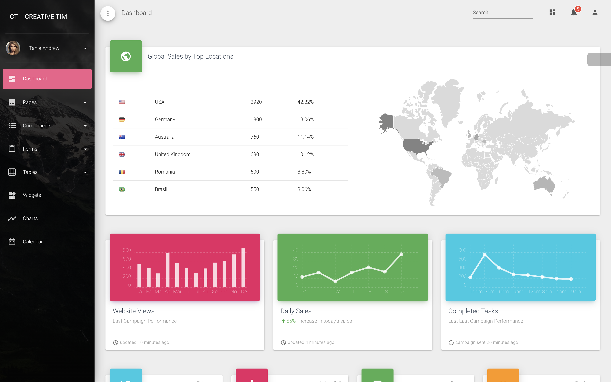
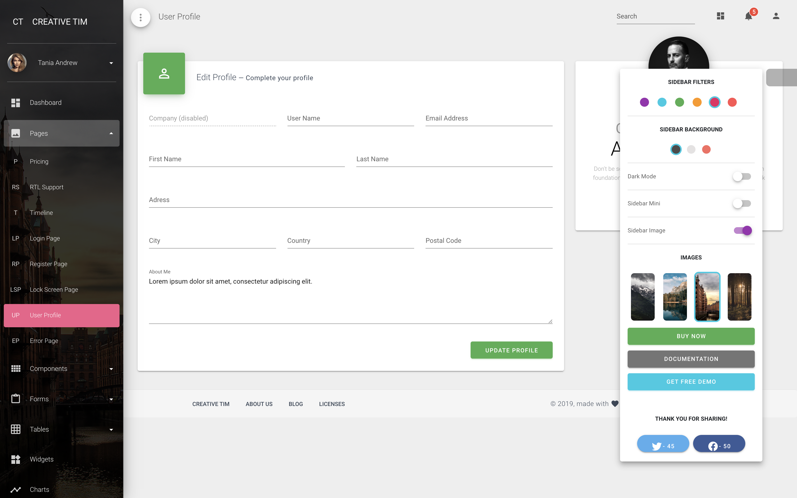
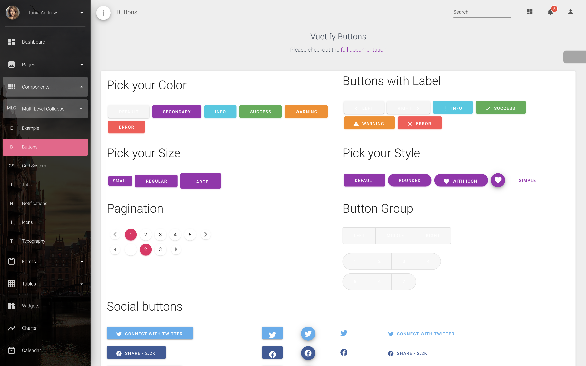
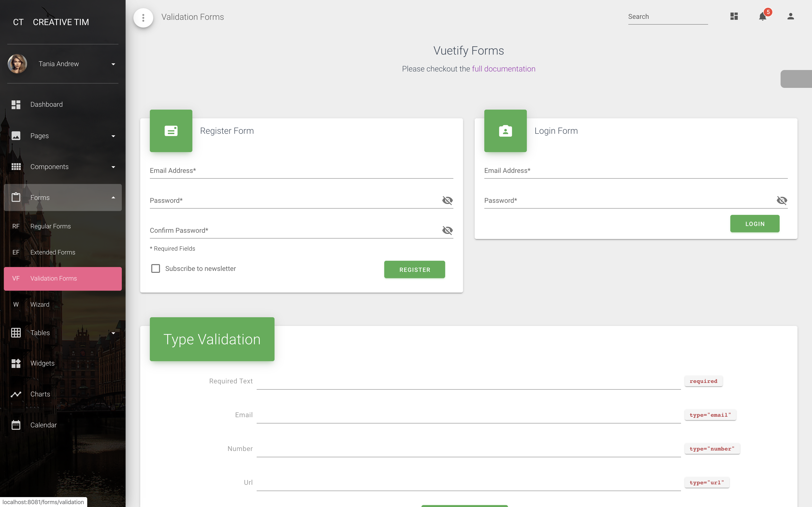
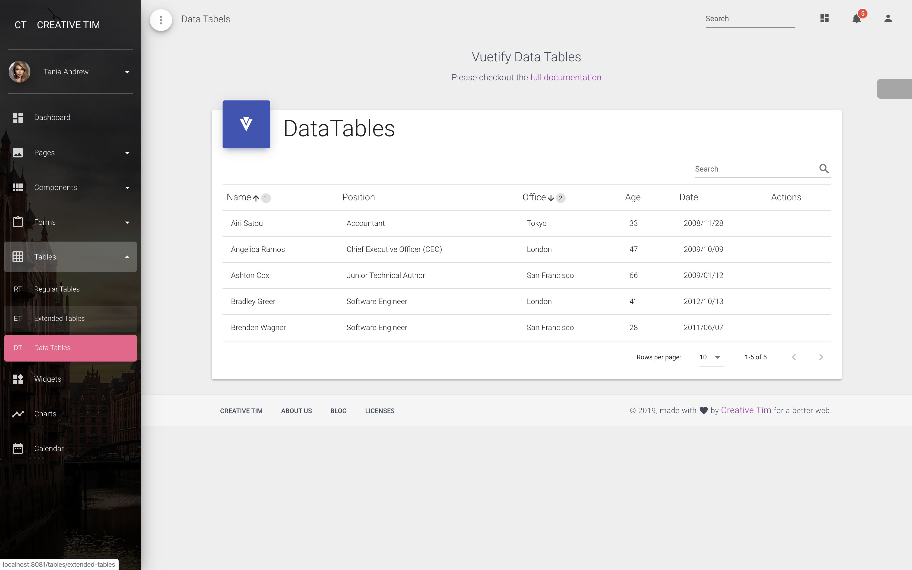
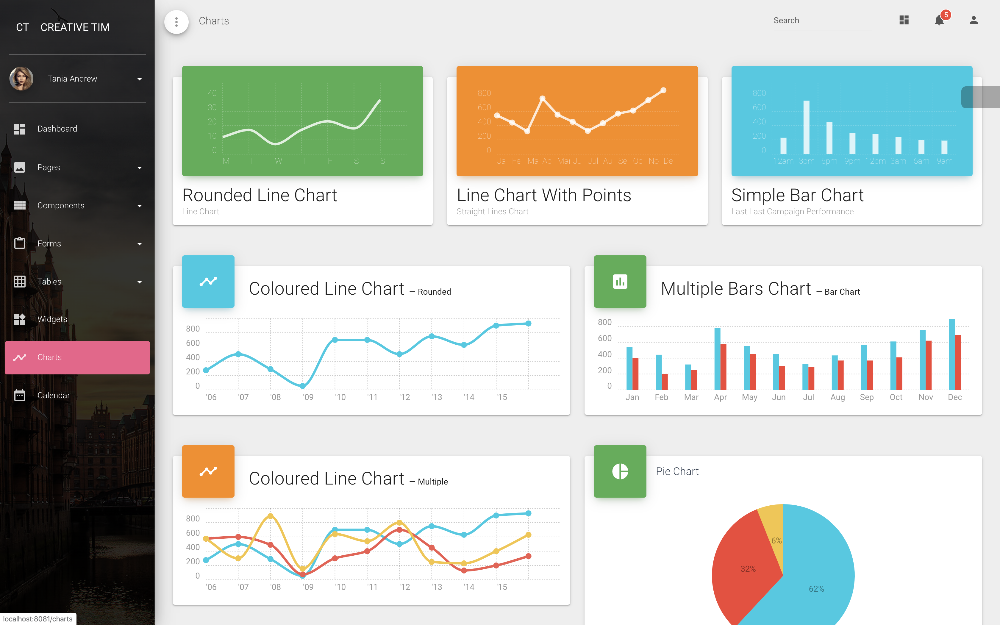
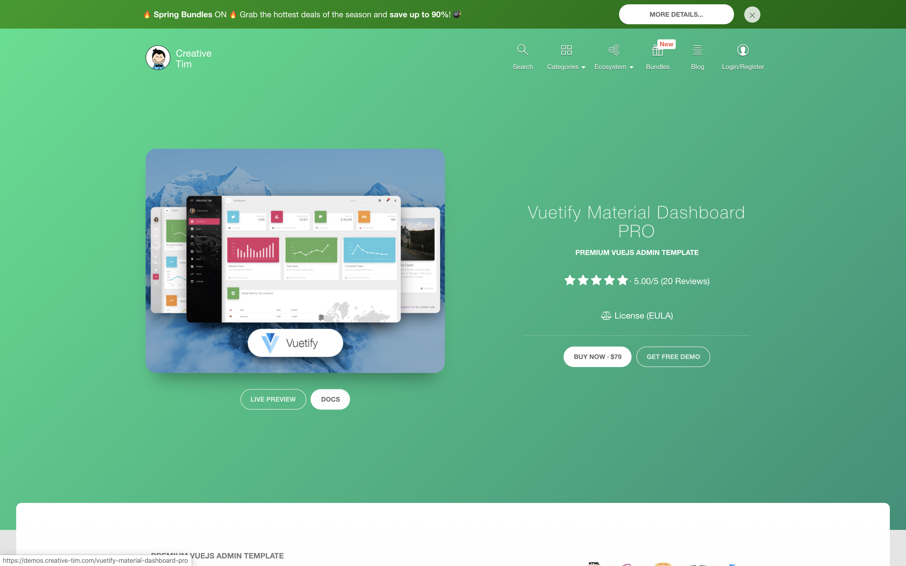
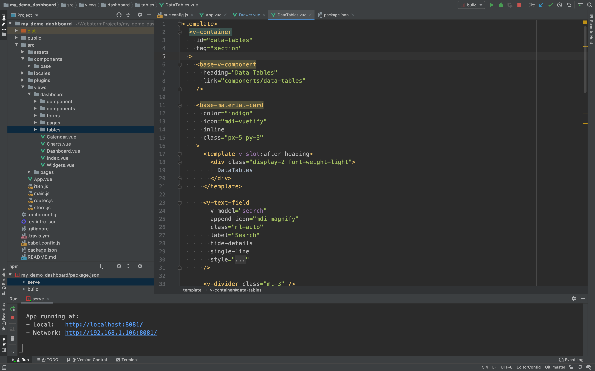

Vuetify后台模板by CreativeTim
===
## Demo
<a href="https://demo_dashboard.1owo.com/" target="_blank">
    访问在线demo
</a>

部分截图:  

## 介绍
Creative Tim是国外一个设计团队，专门出网站模板。  
美术🎨明显出自设计师之手的后台模板，颜值明显领先于一般后台模板。  

版本: 2019，Vuetify，Pro版。已稳定，官方后续不会有大更新。非免费版。  
官方售价: 79$。约560元。

技术描述: 
- 基本框架: Vue。非bootstrap4、react、angular等版本。
- 组织结构: vue-cli3生成。
- 基于UI框架: Vuetify。vuetify是谷歌material design风格的vue组件封装。国内市场占有率仅次于"ElementUI"和"AmazeUI"，
  如果你有任一 vue ui框架使用经验，看文档将会很快上手。
- 自定义样式: Sass。设计团队基于vuetify写了自定义样式，最终呈现出本模板效果。预处理语言为sass。  
- 组件: 组件和页面都已封装起来。具备vue开发基础的人能直接使用。

## 售价
淘宝上只有几块钱的编译后版本，没有开发价值。  
和一家售卖一千元全版本(vue\react等)的代购。  
百度谷歌也很难找到资源。  
贩卖盗版不道德，不过我这里也好不容易找到的，当二道贩子卖个信息收集的钱。  

售价:**`100元`**  
售出后发送**源代码**压缩包。

'npm install & npm run serve'就能跑起来。不提供技术支持。售出不退不换。  

网页顶部导航/联系我可以找到我的联系方式。

