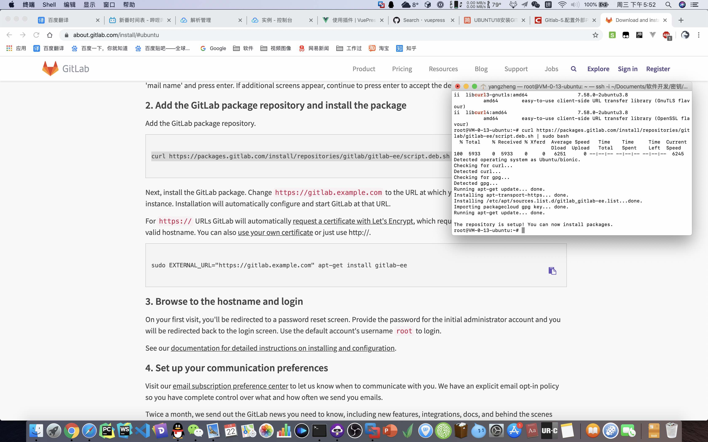

自建Gitlab服务
===
## Demo
(太消耗资源，会导致服务器上其它服务崩溃。限制内存后性能达不到最低要求访问会502，因此关闭。有需求要看demo的联系我临时开启。)

[在线demo 访问http://gitlab.1owo.com](http://gitlab.1owo.com)  
**管理员账户: root**  
**密码: %6qwerty**  

关于账户:  
- 因为只是个人测试学习用的自建服务，没有重要数据，所以放出root账户密码，没见过管理后台的可以看下。
- 普通权限的用户注册非常简单，首页注册表单。用户名随意，密码8位以上，由于没有配置邮箱通知验证功能，邮箱地址随便填写(如test02@1owo.com)也能通过。
- 不想登录的点击首页左下角explore直接浏览。 
- 请不要修改root密码，登录不上联系我重置。
- *仅供学习尝试，不要保存重要代码，服务可能随时停止。*

可以尝试的功能:  
- git基本操作，推送、克隆
- 配置ssh key
- 管理员新建普通用户、管理用户、团队。管理员设置在页面左上🔧图标，用户个人设置在右上角头像。
- CI，gitlab runner，gitlab pages

## 效果图
安装

初始化

效果

管理员设置

其它配置
https

个人设置、语言

邮件提醒

持续集成

工作流管理(来源网图)

刚建好的服务没什么demo数据，有三张图片来自网络。  
更详细的过程详见教程文章。
 
## 时代变迁
代码管理工具是软件团队必备、程序员必会的工具。  
从早期的 自己复制备份代码、QQ传文件项目经理合并(别笑、2013年我刚工作时一个价值不菲的大项目就是如此操作),
SVN(前些年家家公司必备但经常沦落为文件网盘)所以才有了上句所说的操作, 到现如今Git成为主流。

我在2016年才接触到正规使用git管理开发代码的公司(郑州毕竟晚于一线城市，现在2019已经全面普及了)，公司在内网搭建有gitlab服务。
刚开始学习git时感觉复杂，命令行操作，为什么不自带图形界面，为什么不SVN。add、 add .、 取消stage、 commit -m、分支、checkout、tag、 冲突等
新概念让人迷惑，其实主要是当时水平低😂。  
后来，随着越来越熟练，git、github已经完全离不开，渐渐理解每个命令的作用。git提供的时间机器让开发者无后顾之忧，在pycharm这样的ide中一个按钮就可以还原到某个时间点。

## 选型、场景
- github。最为知名、资源最为丰富、功能成熟，但因为~~众所周知~~服务器比较远的原因，clone速度较慢。
- gitee。国内知名代码托管平台。
- gitlab。较为知名、功能成熟、UI美观😊、重量级。使用Ruby语言、rails框架开发，CE社区版代码开源，支持自建。
- Gogs。不太知名、国人项目，轻量级。支持自建。是除gitlab之外的自建选择。

场景：  
1. 公司内部追求代码安全🔐和访问速度，不想放到第三方代码托管平台(如github、gitee)的，会选择在公司内局域网搭建git服务。
2. 已有git、github基础想见识gitlab的程序员。学习搭建gitlab的运维工程师。

## 搭建教程
本文侧重展示效果，技术文章具体参考[todo 有空更新]()，
内容包含：安装方法选择、捆绑安装包中各软件作用(2015年所在公司技术部率先使用ruby生产开发，稍微了解一点，可惜ruby没火起来😂)、邮件配置、https配置、CI CD配置等。

我尝试过源码、omnibus捆绑安装包、docker三种安装方式。使用omnibus安装时实现了邮件、https、CI等配置，
但捆绑包内多个软件的端口不好管理，服务器还要放其它项目，因此停掉后又开了个docker容器。
容器方式较为简单，但gitlab部署不是我的重点关注项目，另排错麻烦，因此暂时没有配置邮件、https，仅供尝试下界面。
由于gitlab非常占用资源，demo可能随时关闭。

 
