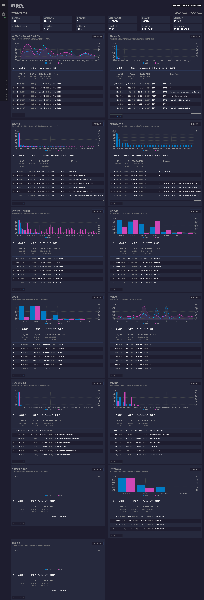
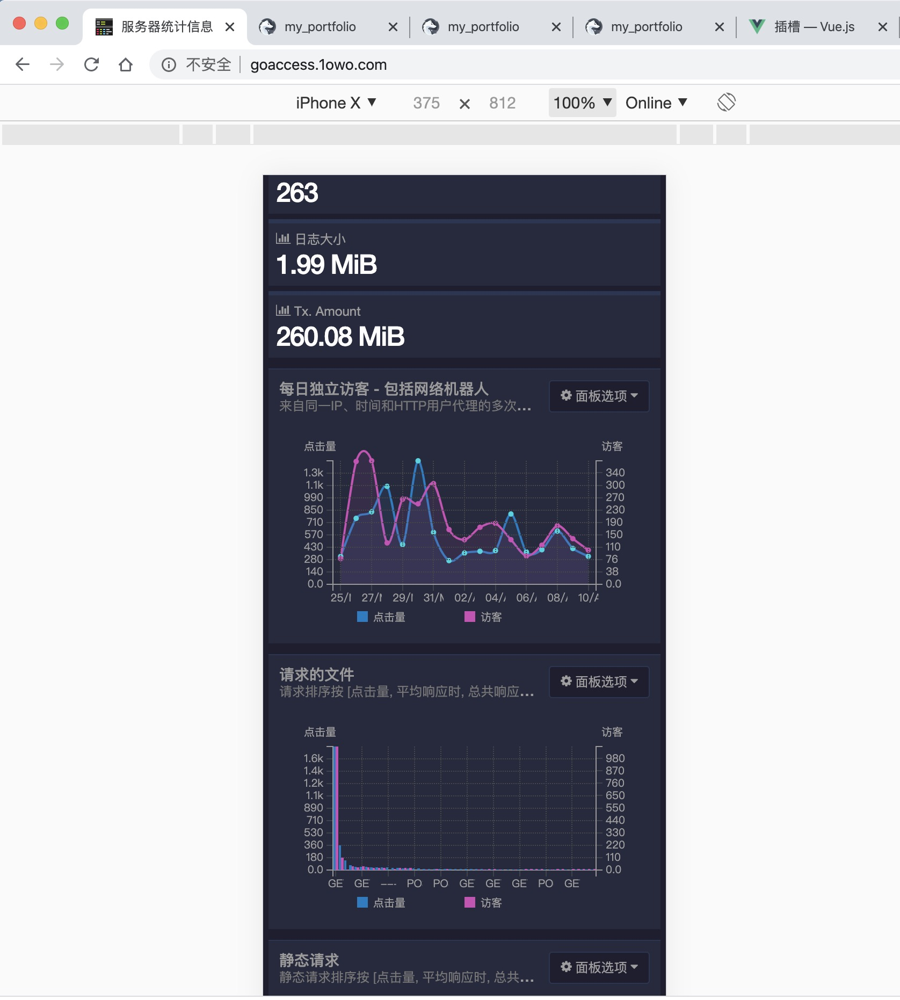
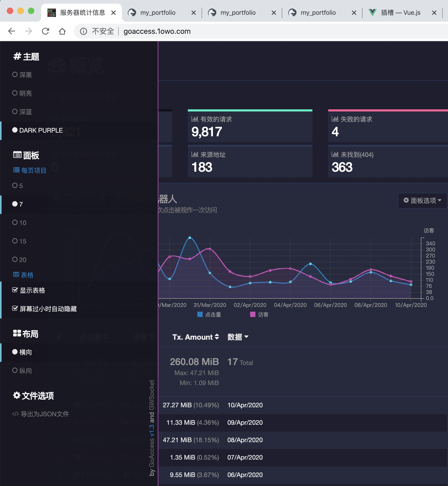
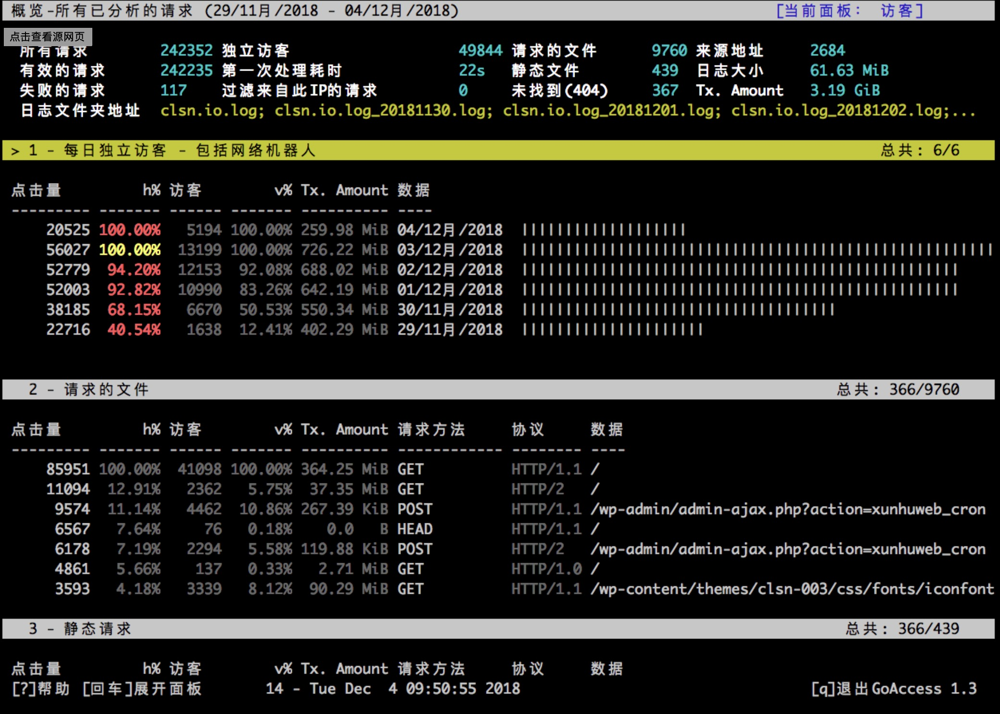

goaccess日志分析
===
## 介绍
[github 仓库 allinurl/goaccess](https://github.com/allinurl/goaccess)

goaccess是一个运行在linux系统上的日志分析工具，
可以轻松与Apache、Nginx等web服务器日志或自定义格式的其它日志集成，
可以以命令行方式或浏览器实时访问方式浏览。  

基于C语言，html使用后端类

## Demo
[在线demo](http://goaccess.1owo.com) 
数据来源于我的服务器，实时数据每秒刷新。如果另开一个浏览器页面刷新我的其它网页，可以发现goaccess数据变化。

## 效果截图
web实时完整。

移动端。自适应布局

设置。同时展示的图表数量，只显示数据不显示图表📈，网页背景等一些简单设置。

命令行。goaccess本身是命令行工具，网上找的一个截图。

## 同类比较
其它日志统计工具:  
  
* linux自带命令。tail。
* 第三方统计平台。一些程序员自建博客、网站时，往往使用百度统计、CNZZ。在html页面header中引入一段js代码，每次用户请求的信息会发送到统计平台的后台，然后登录平台后台可以看到详细的数据。
* ELK。自建日志统计教程中经常看到ELK相关的文章。ELK不是一个软件，而是由Elasticsearch(负责数据存储和搜索), Logstash(日志收集)和Kibana(web展示)三个软件组成的解决方案。

<!-- 注意中英文的| |竖线 -->
方案 | 使用或部署难度 | 功能丰富 | 直观程度 | 数据自己管理 
:- | :- | :- | :- | :- |
系统自带命令 | 简单 | 简单 | 不太直观 | 是
统计平台    | 一般 | 丰富 | 直观 | 否
goaccess   | 一般 | 一般 | 直观 | 是
ELK        | 复杂 | 丰富 | 直观 | 是

## 使用感受&todo
- 部署简单，实时web页面比较漂亮。不必每个应用添加接入第三方平台脚本，只需观察最前面的代理nginx。对nginx日志直接支持，对docker json格式日志需要手动脚本转换日志格式。
- 功能丰富程度有限。访问地区来源📈没有显示，可能只支持国外ip或需要开发，这个数据图表国内三方统计平台做的较好。  
- 实时数据变化功能web前端通过websocket与后端通讯,如果web端使用https,那么必须走wss(websocket secure)协议。尝试良久失败，证书和配置暂时看不出问题，目前demo走http。  
- 每次只支持一个日志，不支持分割或多个日志文件，需要实现整理到一个日志文件中供goaccess读取。或是开启多个goaccess进程读取不同文件。
demo站使用的是nginx的access.log,没有统计error.log。

