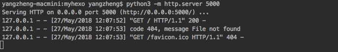

Ngrok内网穿透
===
## Demo测试说明
1. **客户端下载:**  
根据自己💻系统下载对应的可执行程序。  
[MacOS/Linux client](/static/my_ngrok/ngrok)  
[Windows client](/static/my_ngrok/ngrok.exe)

2. **客户端配置文件**  
使用文本编辑工具(如sublime、记事本)或IDE(如pycharm、vscode)新建`ngrok.cfg`配置文件，写入内容:  
```yaml
server_addr: "ngrok.1owo.com:4443"    # 服务端地址，不可修改
trust_host_root_certs: false          # 隧道tcp是否ssl/tsl加密，服务器未配置加密协议，不可修改，不影响功能
tunnels:                              # 隧道配置
    myhome:                           # *隧道名。
        subdomain: myhome             # *公网子域名。建议跟上面的隧道名保持一致。
        proto:                        # 隧道协议，tcp和基于tcp的http协议
            http: 8000                # '本地'服务所在端口。
```

或下载<a href="/file/my_ngrok/ngrok.cfg" download="ngrok.cfg">示例配置文件</a>(内容同上)再编辑  


你可以直接下载使用示例配置文件。  
但存在两人同时测试的可能性。推荐修改隧道名`myhome`和subdomain的值为自定义值，例如'test', 'myhome', 'aaa', 'bbb'。

3. **运行ngrok客户端**  

    **mac/linux** 用户:  
    1. 把可执行程序和配置文件放到同一个文件夹📁下(我这里目录较深，你可以放的浅一些)
    
    2. 打开 **terminal终端**。
    3. cd到可执行程序所在路径。例如根据上图是`cd /Users/yangzheng/PycharmProjects/my_ngrok/bin/darwin_amd64`。
    4. 取得执行权限`sudo chmod u+x ngrok`。或将可执行程序'ngrok'放到系统'/bin'(不是上图的bin目录)目录下。
    
    5. 运行`./ngrok -config ./ngrok.cfg start myhome`。如果修改了配置，注意改变隧道名。  
    
    **windows** 用户类似:  
    1. 把**ngrok.exe**和**ngrok.cfg**放到**D:\my_ngrok**下。
    
    2. 打开**命令行提示符**。快捷键**win+R**打开**运行**，输入(推荐)`powershell`或`cmd`回车↵。
    3. cd到可执行程序所在路径。例如**D:\my_ngrok**。
    4. 运行`./ngrok -config ./ngrok.cfg start myhome`。
    
    
    
    **成功效果**:  
    运行成功后status为online，并看到公网到本地的映射关系。
    
    如果提示隧道已存在，那么修改配置中subdomain的值。  
    
4. **运行一个本地服务**
为了测试，在本地电脑开启简单的http服务。注意服务开在上面配置中的端口号。
- python环境。`python3 -m http.server 8000`。这个简单服务会展示命令路径下的文件📃和文件夹📁。
- nodejs环境。`npm install -g httpserver`, `httpserver -p 8000`。
- 其它语言环境或正在开发的web项目。
- nginx代理后的静态文件。
- ftp文件服务。


5. **效果**
访问公网地址`http://myhome.1owo.com`, 结果访问到了个人电脑上的web服务，看到ngrok客户端上有新日志刷出。成功🎉。


最后理一下思路: 
http://myhome.1owo.com:80 ➡️ http://127.0.0.1:8000 ➡️ 本地文件
## ⚠️注意事项
- 测试完记得关闭客户端。不然
    - 其它人容易隧道重名。
    - 你的信息暴露在公网上。
    - 运营商有包过滤检测技术，发现家用宽带长时间运行web服务会处罚。
- web服务不要分享政治、黄色类信息。
- 如果客户端connection单纯的failure失败，可能ngrok服务端未启动，联系我检查。

## Ngrok介绍
Go语言代表项目之一，内网穿透领域最知名的开源项目。  
场景:
- 家庭宽带没有公网ip，即使有运营商也不开放80端口，即使开放也会检查。想运行web服务。
- 本地开发测试，直接通过域名访问而不用先ftp上传⏫代码到服务器。

## 服务端部署教程
**无，未来不打算更新**😈。因为:  
1. 我不会、不打算系统学习go语言。即使是现成的项目，部署仍踩了一些坑，花了很多时间无目的尝试。所以未来即使有内网穿透需求也会找自己擅长的python实现。
印象比较深的两个坑是:
    1. 例如ngrok源代码依赖go1.8,并不是安装go1.8编译器就可以了，编译过程仍然会报错缺少go编译器，但已经安装过了呀🤔️？答案是缺少的是go1.4,
    因为go编译器为了提高自己的开发效率更快迭代版本，放弃C语言而转为使用go1.4，自己开发自己，也是个特色😮，因此需要安装两个版本的编译器。
    2. linux服务器上，不指定参数，命令默认编译出的是windows客户端，指定平台参数编译出来的也不可用。答案是需要重新生成环境，
    再在编译命令时参数专门指定编译目标平台为darwin(既macOS、Macintosh之后又一个表示macOS平台的名词)。这个过程叫**交叉编译**。
    对于长时间使用解释性语言的人来说是知识盲点。
2. 2020年初发现官方已升级为v2版本，官方docker镜像看了半天说明迷惑怎么变化这么大，一看官网懂了，跟gitbook一样，开源软件火了就开始收费了，
表示理解毕竟开发者要吃饭。v2服务端代码闭源，人们只能付费下载客户端接入官方服务器。那么还不如选择国内的ngrok或frp服务。 

demo版本为ngrok 1.x。我使用过源码部署和docker部署。想自己尝试的参考  
[一教程](https://cloud.tencent.com/developer/article/1575362)  
[docker hub hteen/ngrok](https://hub.docker.com/r/hteen/ngrok)  


---
其余一些不太重要的过程截图供参考:





