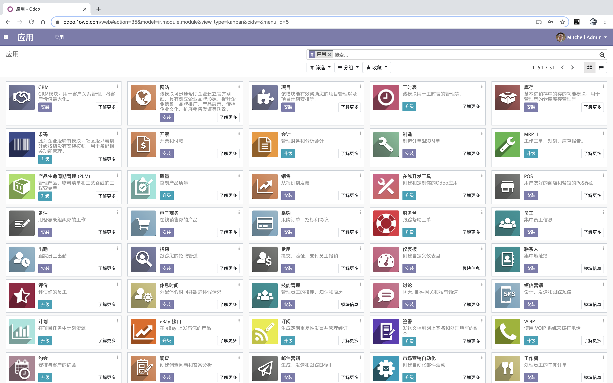
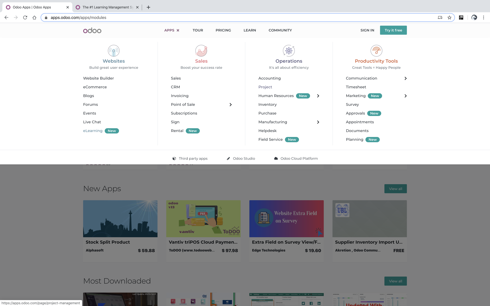
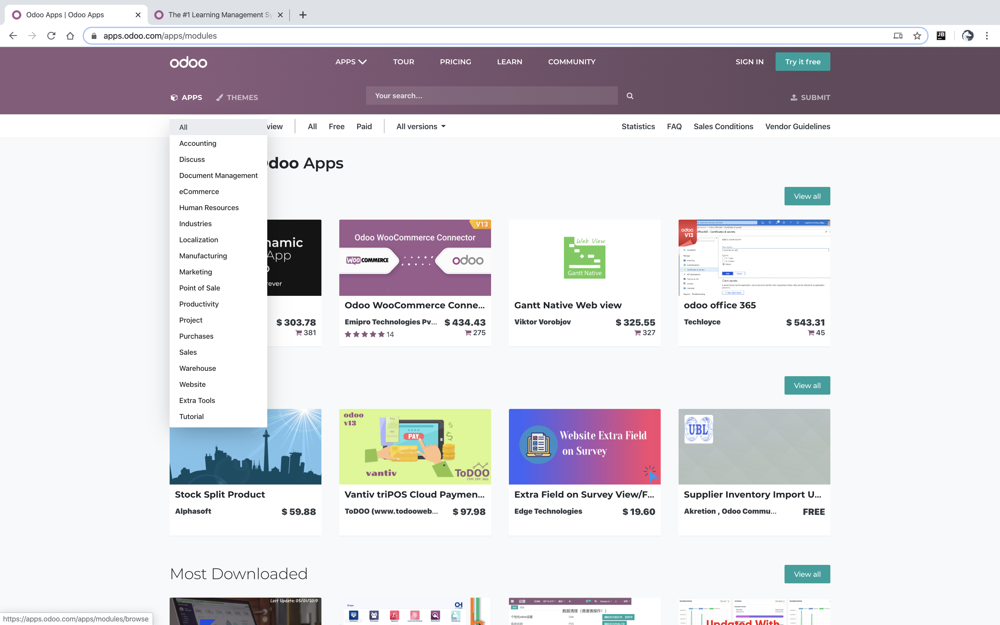

odoo介绍
===
last update: 2020-04
## 在线Demo
访问[odoo demo v13.0](https://odoo.1owo.com/)

现成的账户:
- 管理员  
  账户名/邮箱: `admin`  
  密码: `admin` 

- 普通用户  
  账户名/邮箱: `demo`  
  密码: `demo` 

开始尝试:  
登录管理员安装功能。安装不同功能的app，例如安装一个CRM客户管理或网站模块，尝试不同的功能和软件操作习惯。  
登录普通用户使用功能。可以新建几个普通用户，从一位用户发起某项申请，再登录他的上级用户审核，感受工作流。  

注意事项:  
**默认数据库"odoo"，这个库不要删除，不要修改管理员密码**。👆上面的两个账户就是在这个库下的。我为这个库设置了删除密码。  
偶尔报错正常，因为配置不正确，这毕竟只是demo，错误配置会导致数据不正常。  
如果确认不能登录和访问首页，请联系我重置服务。

如果你想从头开始尝试，增加用户、修改用户密码。那么可以退出当前用户，在登录页面点击'manage database'，新增加一个干净的数据库。

---

## 介绍
[odoo官网](https://www.odoo.com/)
> Odoo（先前曾名为OpenERP，更早之前则为TinyERP），是一套企业资源规划（ERP）及客户关系管理（CRM）系统。
以Python语言开发，数据库采用开源的PostgreSQL，系统以GNU GPL开源协议发布。
系统提供较灵活的模块架构，常用模块包括：采购管理、销售管理、库存管理、财务管理、货品管理、营销管理、客户关系管理、生产管理、人事管理及服务支持等等。
用户可以直接从模块库中选择安装适用模块，或进行模块卸载、升级的管理操作。
客户端用户界面是基于GTK的，同时支持Linux和Windows平台。当前还有开发中的基于TurboGears的eTiny Web客户端。

项目组织:  
类似django。
数据库:  
支持且仅支持postgreSQL🐘数据库。我喜欢这个决定。

app/模块:  
依赖app(或者叫模块，也可以叫插件)来进行功能扩展，清晰独立。官方生态很好，可以从商店取用，软件公司也可以开发模块进行售卖。  
常用模块: 采购管理、销售管理、库存管理、财务管理、货品管理、营销管理、客户关系管理、生产管理、人事管理及服务支持等等。  
官方模块在首页顶部导航Apps下。  
第三方模块: [三方模块商店](https://apps.odoo.com/apps/modules)。  

goodERP:  
国内一公司基于odoo进行开发，适合国内业务一般习惯。
优点是odoo的本土化。缺点UI有点丑；更加小众；由于更复杂的类继承关系，开发查找字段需要同时熟悉goodERP和odoo源代码。

## 截图
首页。其它请直接体验demo。

模块商店。好的生态比技术更重要。

## 开发体验
odoo的项目结构类似django，一大块业务逻辑的代码集中在一个文件夹，封装📦为app模块。有django基础的上手很快。  
框架封装一方面好像降低门槛，有些app直接安装，或在图形界面点点就能开发流程。  
但另一方面其实也加大源码理解难度：报错不易排查；到处都是类继承，看懂一张表可能需要往前追溯三个类；
不能直接写html，连一个button按钮一个a链接都需要配置，有java的影子。

官方文档似乎很完善，但还是🤷‍不知道如何开发，理解的关键是**building a module**这个教程，这才是这个框架的**start tutorial**。

框架只是工具，熟悉工具后应该把精力放到业务上，公司的业务并不是跟自己没关系，理解业务才能更好地抽象现实问题和开发，才能拓宽未来的职业思路。  

## 流行度现状
现状: 2000年左右，有商业公司背书、跨平台的java语言席卷编程市场，大型公司的管理系统由java开发。  
大型公司的业务和数据变更成本很高。所以时至今日仍占据ERP软件统治地位。  

Python生态的ERP代表软件为odoo，在国内实属小众。  
2016年底接触时只有英文文档，官方文档内容全面，但没有主次，没有start tutorial，每块文档好像看懂了又不会如何用起来。  
国内只有"穴蟒"(百度可搜索到)出odoo8.0系统中文教程(彼时odoo10已发布)。  
2019年感觉这几年市场占有没什么增长。根据智联招聘，郑州大概只有两家公司招相关程序员，一线城市多一点但也没几家。带的学生情况，约百分之一从事odoo开发。  
(听说)金蝶的代码他们公司自己程序员都快看不懂了。  

Python越来越火🔥，真的好用，希望未来odoo能在国内占有率提升一点🤏。

## 服务端搭建
如果你想在本地尝试  
- docker方式。[docker hub odoo](https://hub.docker.com/_/odoo)
- pip方式。'pip install odoo'。刚才查询了一下pypi平台，已找不到相关包。原来有一段时间是可以的，自带sqlite数据库。缺点服务不稳定容易搞坏。可能已被官方下架。
