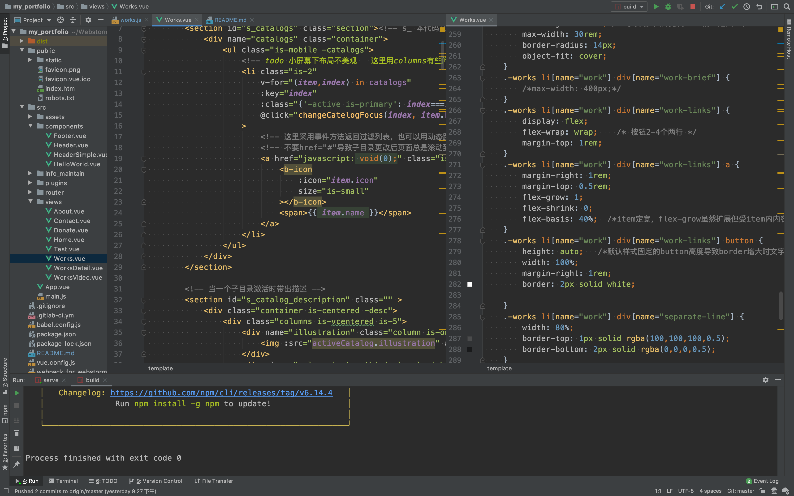
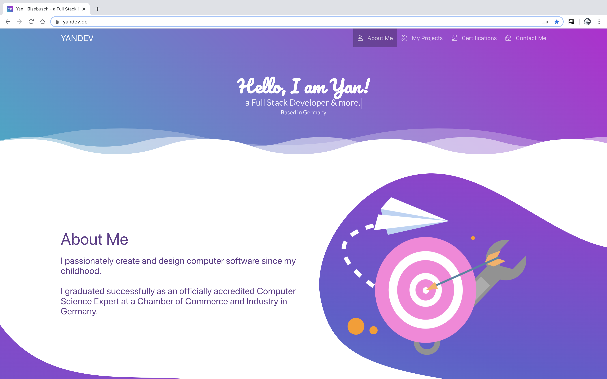

## Demo
在线地址https://portfolio.1owo.com，就是你现在看到的这个页面。  
<a href="https://gitee.com/canaan_ge/my_portfolio" target="_blank">git仓库。</a>

## 截图

源代码  

原版网站首页  

## 介绍
2020年初，适逢疫情和换工作间隙，想把这几年好好总结一下。作品内容主要来个人工作总结、项目、教程、开源demo，很高兴有整理资料的习惯，所以迁移的比较顺利。

作为python后端，在2019年兼任带了一个前端班。前端基础熟练后，对框架终于有了进一步的理解，可以按照自己的想法做东西，想用vue做一个站点。
在比较十种流行的vue ui 框架后，选择了buefy。一是此框架界面明显出自设计师设计，跟其它UI库的同质化不同。
二是尝鲜，市场占比的前几种UI（elementUI、IView、Vuetify）库略有接触过，想换个新的。  

然后访问了<a href="https://buefy.org/" target="_blank">Buefy</a>官网熟悉文档。
这时在buefy的网站展示区看到了一位用户上传的作品  
<a href="https://yandev.de" target="_blank">yandev https://yandev.de</a>  
这真是我理想中想成为的人的样子👍！  
我翻阅了网站了解了下这位大神：儿童时期开始接触电脑学习编程，全栈工程师。主要做前端和游戏、UI、后端、服务器等也不在话下。再看网站，因为我做过UI，所以明白
他的UI也是专业的，找到了他做的作品，dribble论坛级别的。网站如此美观，设计稿和实现结果一致很难得，UI和前端开发的完美结合。
他的网站有很多细节:  
- 设计统一。图标、动图风格、色彩统一。
- 代码中各种秀技术。首页不规则动态边缘我没看到过同类模板，应该是作者自己想的，我想了一会猜测了下实现，
adobe AI中画出矢量图形和动效，导出为svg，再作为网页背景。其它的如各种动画动效，导航栏模糊背景。漂亮的波浪分割线。代码中即使用来布局，也会flex和table方式各用一次。
- 网页端和手机端的自适应做的都很完善。
- 作品技术覆盖面广，很多都有在线地址。

然后我就想照着他的网站做，本来不想模仿他人，但他的网站太完美了，契合我的理想。作者肯定费了不少功夫，不好意思全抄、不想用逆向编译。
于是照着他的设计稿自己写代码当作练习，写的过程熟悉了vue和buefy的使用，从搭架子到每行代码到css都是自己写的，对于后端还算不错吧。插图来自dribbble。
最终我实现了大半效果，但移动端布局、一些细节效果、代码设计跟原版仍有差距。暂时不会修改了，未来可能重写，下一次将会原创设计。

## license
网站样式模仿自yandev.de 。  
插画图来自dribbble 。  
图标来自material design。  
我的仓库代码开源。我的个人作品信息src/info_maintain目录禁做他用。  

