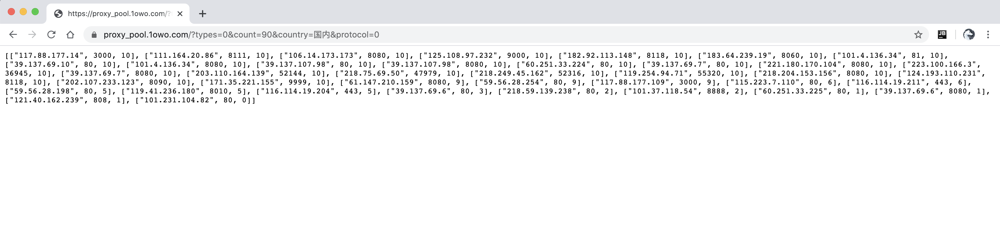
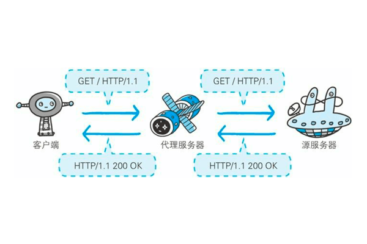

IP代理池使用说明
===
## 效果
很一般，项目筛选后总共50个左右，带入自己的网站请求，可用性约两成，最终可用10个左右。  

场景：适用于个人项目。正在写一个豆瓣爬虫脚本，为了防止被封每3-5s请求一次，很慢。访问过频导致ip被封一天完全不能访问。
这时有一个代理ip就能继续跑项目，有几个可用的就能加速几倍。  
救急用，不想购买付费代理服务时用还是可以的。  

## Demo使用说明
### API说明
请求类型: GET请求  
参数:  
| Name | Type | Description |
| ----| ---- | ---- |
| types | int | 0: 高匿,1:匿名,2 透明 |
| protocol | int | 0: http, 1 https, 2 http/https |
| count | int | 数量 |
| country | str | 取值为 国内, 国外 |
| area | str | 地区 |

完整请求url:  
<a href="https://proxy_pool.1owo.com/?types=0&count=90&country=国内&protocol=0" target="_blank">
    https://proxy_pool.1owo.com/?types=0&count=90&country=国内&protocol=0
</a>

响应:


### 验证脚本
得到ip列表后可以应用到爬虫项目中。  
<a href="http://icanhazip.com" target="_blank">
    http://icanhazip.com
</a>
可以返回请求者IP。项目根据此网站验证可用性，但依然不保证下次就能成功，根据测试接口返回的ip列表的成功率大约只有两三成。


下面是简单的python验证脚本:  
```python
import requests

proxy = {
    # 注意接口请求的参数type，得到的结果是http还是https协议的，把ip和端口号按下面格式整理。
    'https': 'https://183.64.239.19:8060',
}
head = {
    'User-Agent': 'Mozilla/5.0 (Windows NT 6.1; WOW64) AppleWebKit/537.36 (KHTML, like Gecko) Chrome/50.0.2661.102 Safari/537.36',
}

# http://icanhazip.com 返回请求者ip，也可以改成你的目标网址来验证。
resp = requests.get(url='http://icanhazip.com', headers=head, proxies=proxy, timeout=5)
print(resp.text)
```

在爬虫项目中，应使用代码让上面的验证过程自动化。

---

## 原理介绍
《图解HTTP》书中的这张图很清楚  
  
是不是想起了什么，没错，跟翻墙上网原理很像。我的电脑➡️美国的电脑➡️谷歌、脸书、油管。  
以自己发起请求到外面这个方向定义为正，这种代理叫'正向代理'。那么nginx是别人访问你的服务器，所以叫'反向代理'。  

但http代理非常简单，有清楚的信息记录在请求头中，所以没有人用它来直接翻墙上网，科学上网适用的是其它协议。
http代理可以在请求头中记录我从哪里来、中介电脑是谁(透明代理)，但这样会被网站清楚地知道你在代理、你可能在爬虫。
所以代理服务中也可以设置匿名，经过匿名代理的请求不会在请求头中暴露信息(匿名代理)。

## 代理ip市场
爬虫项目为了高效获取数据请求频繁，服务器根据请求头封锁请求频繁的IP。
这时就需要上面说的'我的电脑➡️代理到其它人的电脑➡️目标网址'，
需要大量'开启http代理服务的别人电脑的ip'伪装成正常请求。

免费代理:  
代理ip池通常需要购买，销售ip代理的平台会放出一点免费资源作为宣传。
可以自己写脚本，经常作为爬虫的一个练习，用爬虫来爬取各平台免费放出的代理ip信息。爬取后再请求一下百度或查ip的网站判断一下可用性。  

也可以使用现成的项目:  
[github qiyeboy/IPProxyPool](https://github.com/qiyeboy/IPProxyPool) 2020-04有一年没更新了。  
[github jhao104/proxy_pool](https://github.com/jhao104/proxy_pool) 本demo使用的是这个项目。  
2018年时开源项目的ip可用率相当高接近付费，现在不知道用的人多还是怎么的，可用性较低。  

付费代理:  
代理ip服务需要 服务器、ip、并且部署代理ip服务对外访问。所以收集上千、万代理ip的售卖平台成本也不低。  
价格普遍在200-400每月，可用性在50%-90%，不是专门做爬虫行业的应该舍不得买。所以本demo聊胜于无，将就着用吧。
搜索关键字"代理ip"会找到很多平台，这里不详述。  

## 我对爬虫的态度
灰色不提倡、技术上相当于web开发的子集、建议新手学习web开发。接受灰色但不黑色的商业需求，但不喜欢讨论爬虫技术。
