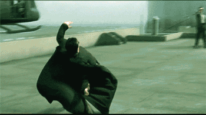
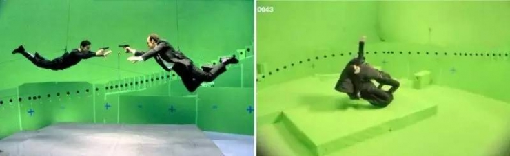
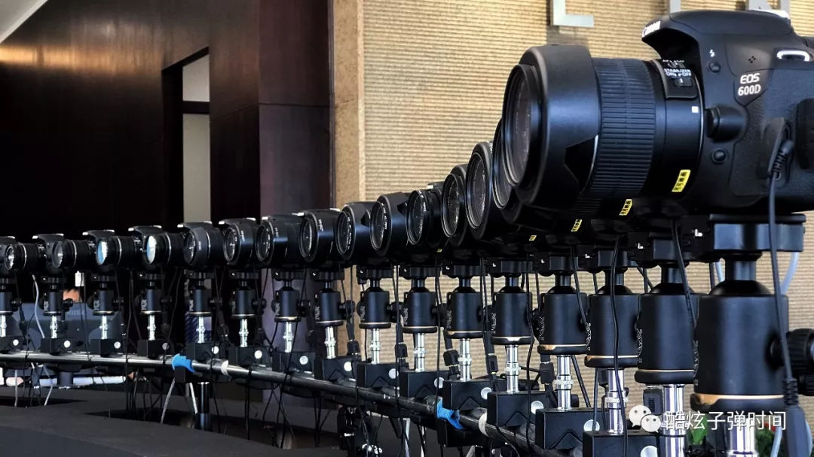
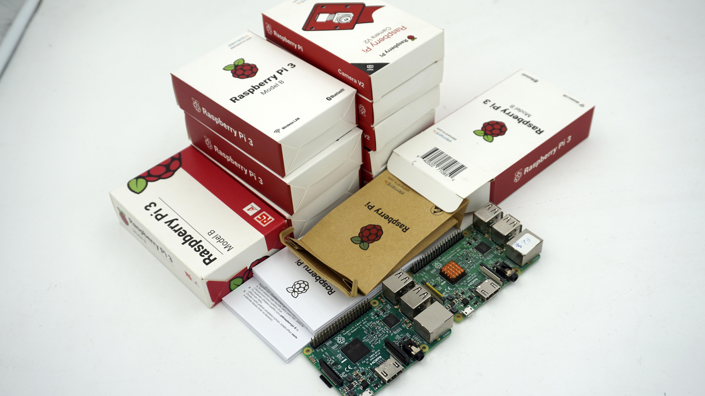
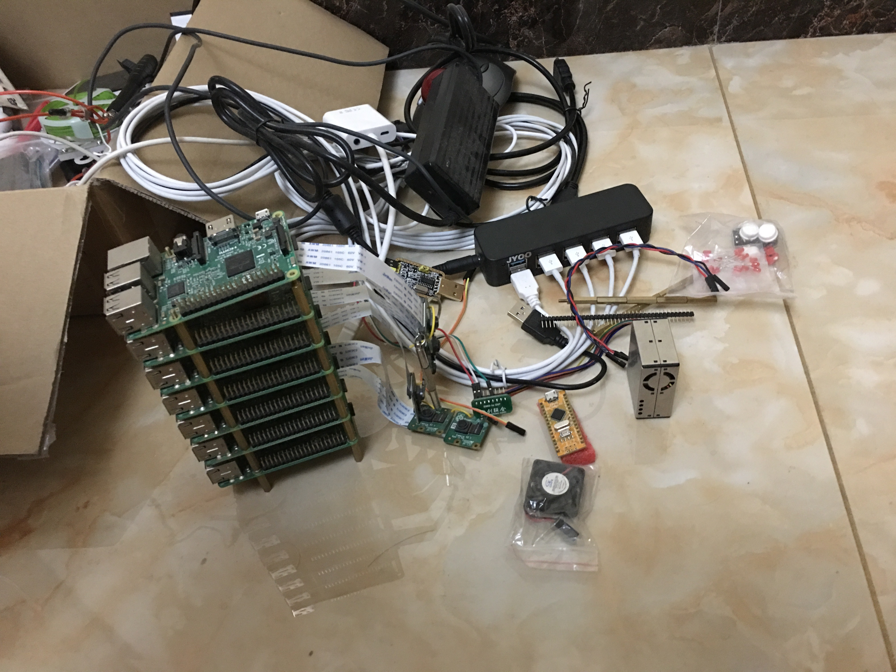

树莓派子弹时间
===
2016年初玩树莓配不久，刚自己做完pm2.5粉尘小项目，对python、树莓派linux、传感器的综合使用有所基础，就恰巧接到这个有趣的商业需求。  

qq群有人问了一下，我回复了一句，竟然就促成了交易，淼哥办事果断。后来经淼哥介绍了需求人朱教授。简要介绍下两位大佬，淼哥跟朋友经营的
**夺冠互动**从五六个人(2015)发展至三百人(2019)，主要做小程序，在郑州互联网圈有一定名气。朱教授的公司**上海无不维文化创意**给春晚和上映电影拍摄子弹时间画面。  

## 子弹时间介绍
> 子弹时间(Bullet time)是一种使用在电影、电视广告或电脑游戏中的摄影技术模拟变速特效，例如强化的慢镜头、时间静止等效果。
"子弹时间"效果因在好莱坞华纳兄弟电影公司出品的电影《骇客帝国》中大量使用名声大噪。其中男主角Neo仰身躲子弹的慢动作镜头堪称经典，"子弹时间"也因此得名。这一技术被广泛应用于影视，广告，创意活动等领域。

  
想达到这样的效果需要一圈摄像头。你可能会想一个相机绕轨道转一圈录像不就行了，但注意条件是拍人运动的某一瞬间各个面，最终发现只有一圈相机同时拍。  
  
也就是非常烧钱🔥💵，高成本为了最终成品几秒钟的美丽。佳能公司有现成解决方案，但也需要高额的软硬件费用。  
  
所以我接到的需求是 "基于树莓派的低成本子弹时间"，只用负责拍照和图片收集，不需要合成，做出原型，不需要考虑实际场地架子搭建。

## 大概技术描述
刚开始时我想的很简单，树莓派和其官方摄像头搭配很好，命令行或python包就可以调用摄像头拍照📷，然后用os包把一次拍照的图片存下来。  

刚开始做后发现，得有个上位机端控制，下位机端分发给各台树莓派。上位机程序采用flask+bootstrap搭建了个程序，部署在一个树莓派或电脑上，
电脑端访问前端页面控制按钮拍照。下位机做接口接收指令，调用拍照包拍照。除了分成两个项目，好像也不复杂。  

**伴随开发进行，发现真正的两大难点随之而来。😓**  
1. 批量，一两台不是问题，批量之后产生许多问题。最终需要五十台到一两百台设备，测试用了6台下位机。  
    
    - 烧录系统。sd卡一个一个烧录系统？太慢，淘宝上也没有多sd口读卡器这种东西。用网线控制多台下位机装系统？只有专业的服务器主机才有这种功能。最终只能手动。  
    - 持续集成。（当年才疏学浅不知道还不知道这个词，一直在搜自动化部署，没有了解到git ci、jeckins、kubernetes等技术。）
        - 上传、更新代码到各个下位机。做一个简单的接口接收信号命令，从git拉取并重启服务？最终在pycharm中配号deployment再点击按钮，半自动。
        - 下位机拍照后回传图片到上位机。因为最终要合成图片，顺序不能乱，而拍照时间几乎同时没有前后。所以要根据下位机的hostname和ip确定顺序。
        每个下位机装完系统后如何自动配置固定ip并自增？又是个问题，尝试用ssh相关的包和fabric包写脚本，但最终没有成功，仍然挨个ssh进去后配置。
    - 电源🔌。电源和插座不够了，台式机上的usb接口或简单接一个usb hub不足以支持树莓派(详细参数查阅充电座名牌 一般为5v 2a，仅供一台)。
      最终在淘宝搜索'手机批量充电'找到了相关产品，但同时需要考虑电压、电流功率，否则带不动。  
      
2. 并行请求。注意是并行不是并发，网上有不少关于并发的文章，后端开发者和大公司也往往追求并发，而在这个需求中追求'并行'，
因为拍一个人跳起，如果下位机拍照时间不同，有的拍到人起跳最高点，有的拍到人开始落下，那么最终照片无法合成或有重影。上位机代码采用协程发起批量请求。  
测试发现，六台下位机拍照一个电子钟然后回传上位机，看相差的时间，误差为20ms。查了下佳能的方案，1ms误差，使用了快门跳线和相机自带的http服务，上位机电脑。
好像跟我的方案表面上差不多。但细节不知差在哪里，是wifi、还是路由器、还是web框架、还是拍照传感器 导致的？一时难以判断。
应该不是wifi，单台近距离ping延迟1ms；家用路由器请求一多转发排队有可能；python的web框架请求阻塞有可能。只能替换排除，成本高，最终未解决。
  
其它过程中的各种小困难：如 连英文资料都几乎搜不到；调试镜头光圈、ISO感光参数；摄像头前加个红十字对齐标记；上班业余、周末、春节都在干；
为了测试、单身狗自己在家蹦跶、同时注意不影响楼下和蹦至最高点时瞬间按下手机上的上位机拍照指令拍照 等等不再赘述。  

最终结果还可以，合成了跳跃起来的子弹时间照片，获得了佣金。最终成果没有留下备份，照片在'屏幕坏了换屏一周又坏、usb读不出来的魅族5手机'中，我懒得修了。
延迟测试和最终成品图片遗憾无法提供。  

树莓派子弹时间的demo效果基本意思有了，但画质远比不上单反阵列成品。下面图片来自甲方网站上的一个作品。  

代码仓库，保密。

## license
禁止转载。甲方已申请专利。