SRS推流直播
===
不理解相关概念的先阅读srs介绍部分。

## Demo测试流程
服务端已搭建好，测试需要向服务端推流和在客户端拉流观看。  

1. **下载安装开源推流软件OBS**  
访问[OBS官网](https://obsproject.com/)
根据自己的操作系统选择对应版本下载⏬。  
如果打不开，百度搜索obs在其它软件站下载，大约100Mb。  
  
*网上有些教程使用ffmpeg，obs也是基于ffmpeg的，但命令行工具不方便，还是建议obs。*

2. **设置和使用obs推流**  
    1. 打开obs  
    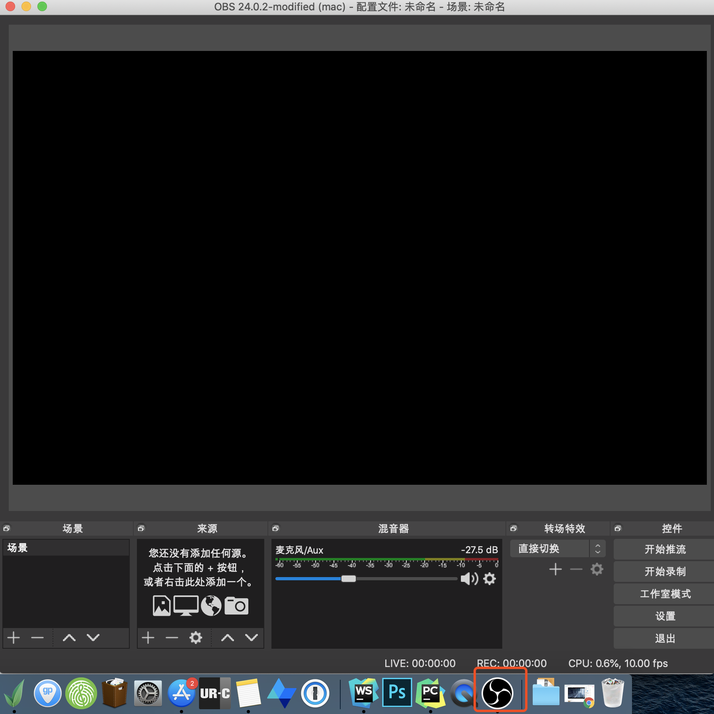
    2. 新建桌面捕获  
    界面下部**来源/➕添加/显示捕获**。  
    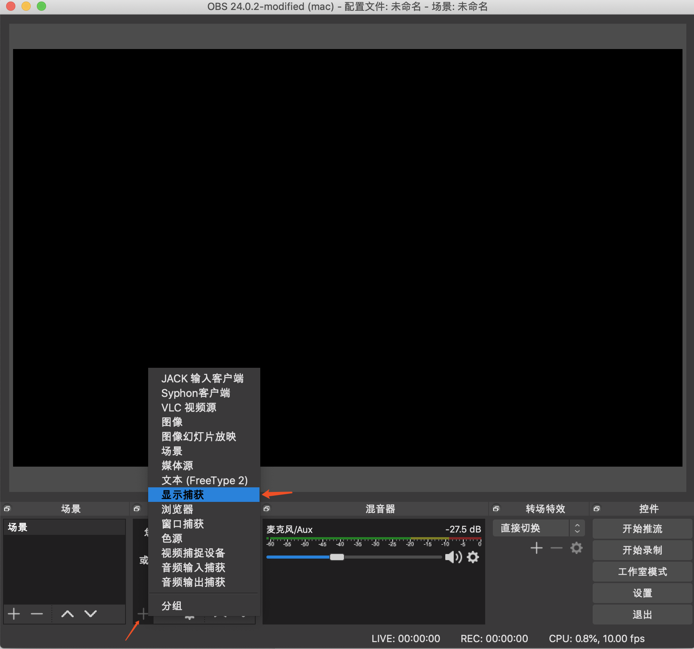  
    之后的起名字、选择显示器对话框一般保持默认点击确定就行，然后看到已捕获的桌面。  
    画面呈现嵌套状态正常，因为软件捕获桌面，桌面里有个obs，obs捕获桌面...禁止套娃😄。  
    你如果看直播平台斗鱼、B站之类的应该见过这种画面。  
    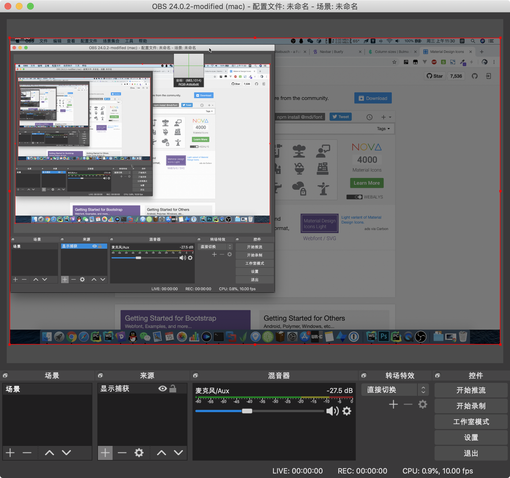  
    3. 设置推流服务器  
    服务端已搭建好服务器，地址是`rtmp://srs.1owo.com:1935/live/livestream`。  
    依次点击obs️**设置/推流**，按图或复制填入服务器地址、app名(房间名)、stream名(obs这里分两部分填入)。  
    服务器`rtmp://srs.1owo.com:1935/live` (域名是数字1不是字母l)  
    串流密钥`livestream`  
    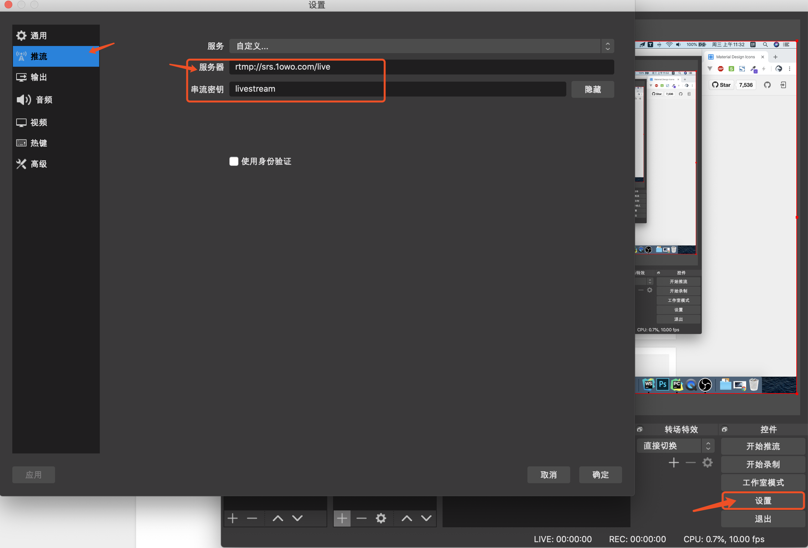  
    (选做)**设置/输出**中设置推送视频码率为500。码率越大越清晰，但服务器带宽有限，4000以上将会卡和高延迟。其它参数关键帧、B帧暂不详述有兴趣自行搜索。  
    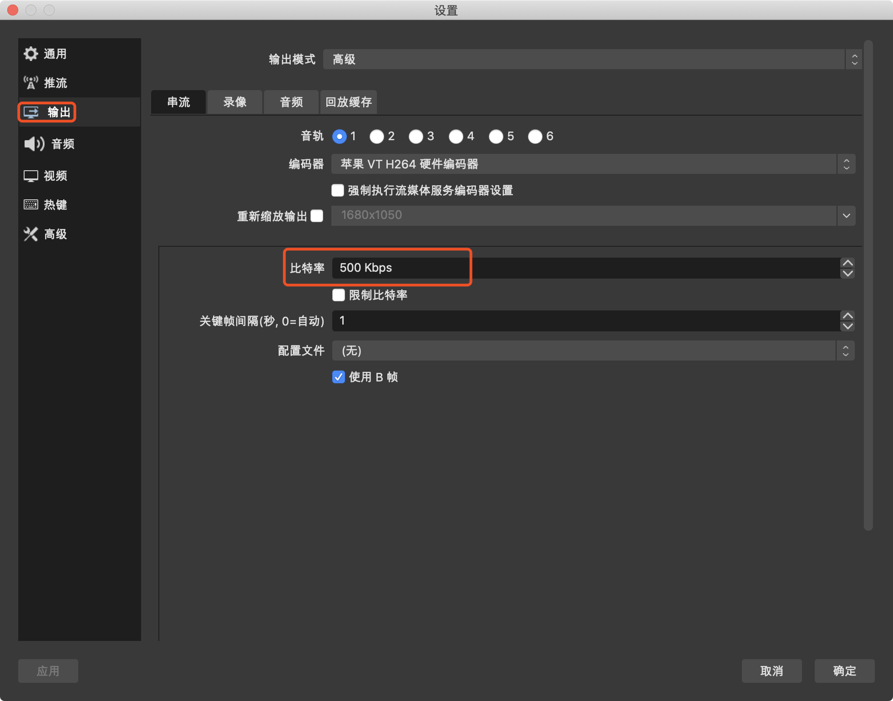  
    4. 开始推流  
    obs右下↘️点击**开始推流**。如果成功，将会很快在最下方一行看到绿色🟩标记、时间、码率等信息，说明本地信息正在上传⏫至服务器。  
    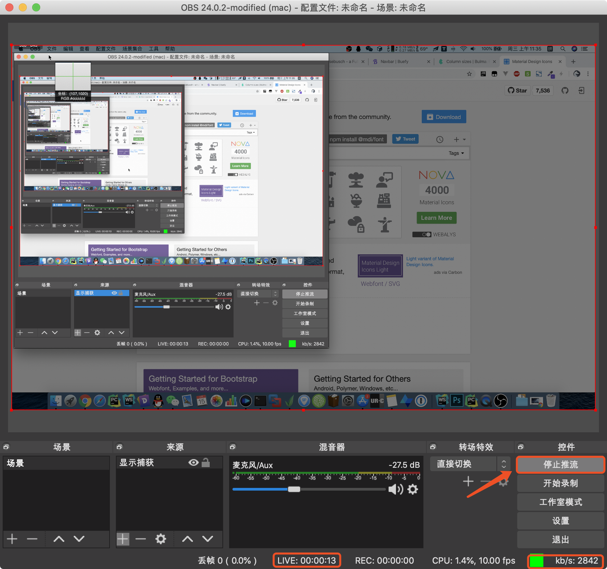  
3. **访问客户端**  
    1. 访问客户端。推流成功后需要一个播放器来拉流播放。  
        - 直接访问客户端网页。  
        <a href="https://srs.1owo.com/" target="_blank">点击访问client.html</a>  
        - 或下载到本地电脑💻(如果你想看源代码)。下载client.html到本地电脑后再用浏览器打开。  
        <a href="./static/my_srs/client.html" download="live_client.html">下载client.html</a>  
        客户端源代码大概原理是用video.js拉取rtmp视频流再调用flash播放视频。如果你自建srs服务，可以修改拉流地址指向自己的服务。  
        可以有多台客户端(下位机)访问client.html。  
        
        客户端页面打开后，目前显示"X"号和"No Source"。
        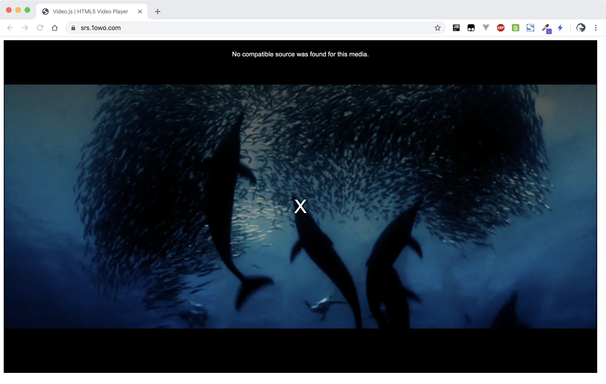
    2. 设置浏览器允许flash。  
    因为现在直播大多基于rtmp协议。不像flv协议基于http浏览器可以直接播放，低延迟的rtmp协议依赖flash播放(都是adobe公司的产品)。  
    因为flash的老态龙钟和w3c推广html5，浏览器对flash也越来越不支持。特别老的浏览器默认支持，老一点的chrome会询问是否启用，
    而新版本的chrome(虽然自带flash)默认禁止。  
    所以我们需要先设置chrome开启flash支持。以chrome_80版本为例，需要点击**网址前🔒图标/网站设置/✅允许Flash/回到客户端页面刷新**
    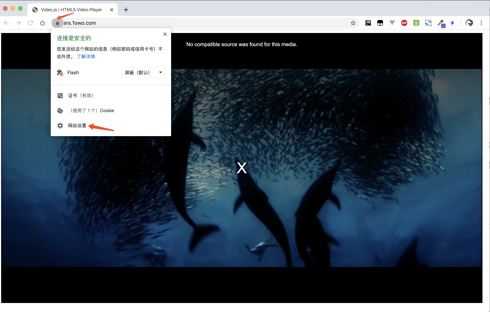
    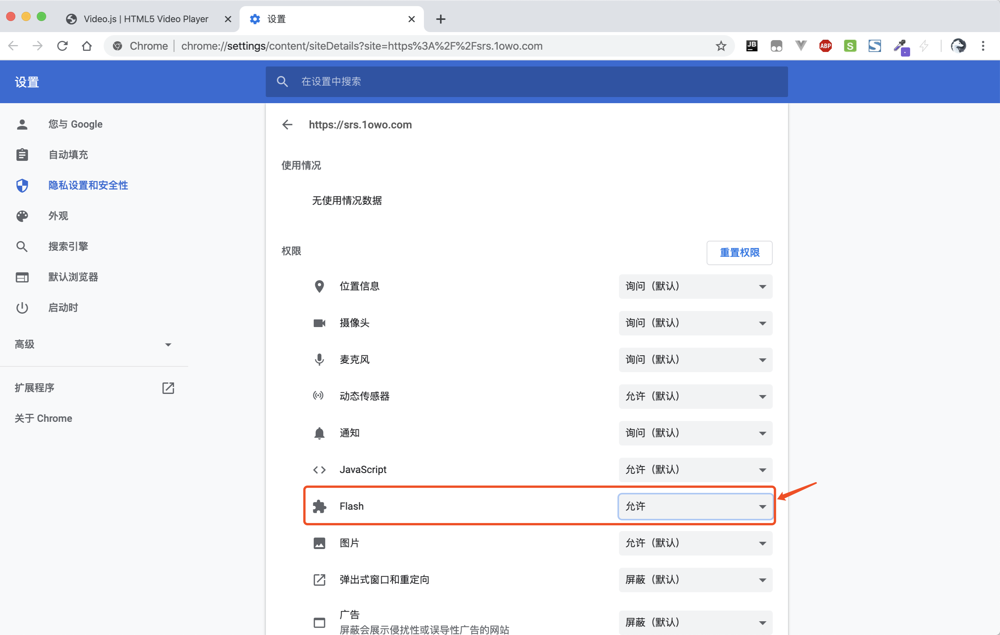
    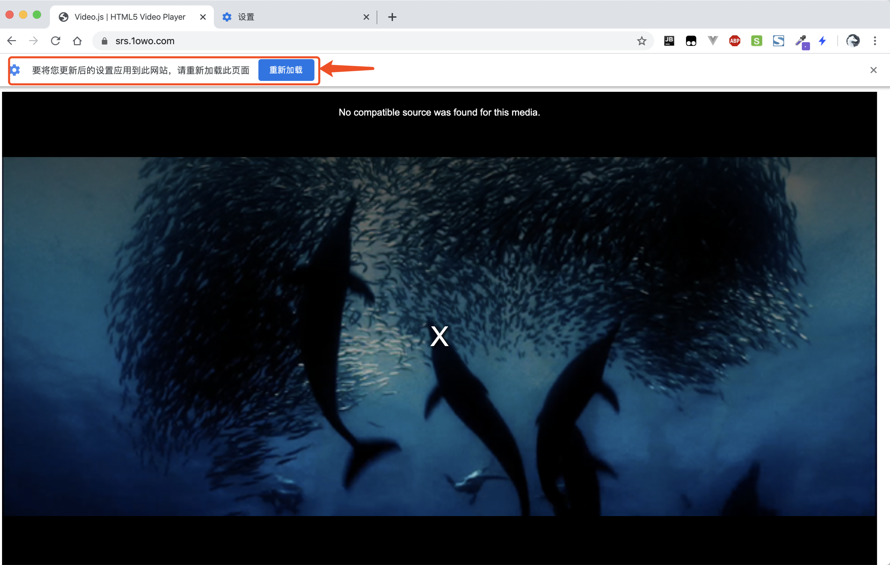  
    设置后客户端页面不再显示"X"号并显示播放按钮▶️
    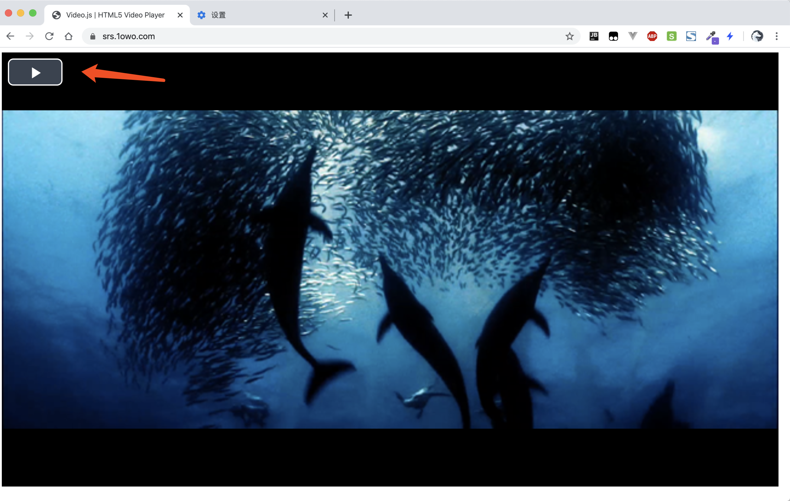
4. **运行客户端**  
点击播放按钮，等待几秒(视关键帧间隔和网络质量 1-30s)，观看到了本地桌面视频，成功🎉:  
左边窗口obs推流，右边浏览器访问客户端拉流播放，自己的电脑即负责推又负责拉。窗口嵌套，精神污染😂。  
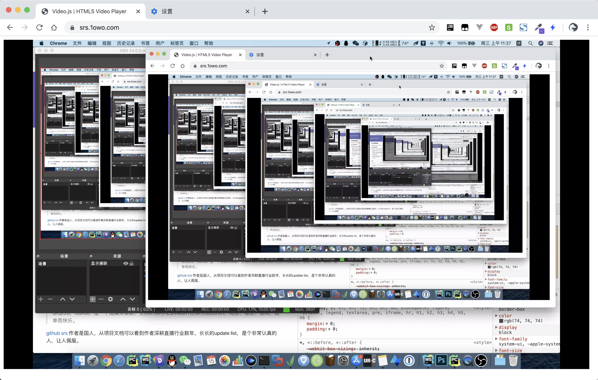
为了更接近现实产品的效果，可以推流电脑放个视频，其它下位机电脑或支持flash的手机📱拉流，这样就没有嵌套比较清晰了(没错，我就是在秀💻🖥️电脑😈):  
右下推流，其它两台拉流，注意时间延迟几秒。
<video src="./videos/liveresult.mp4" type="video/mp4" controls loop muted></video>  

## 测试结果
我在班级局域网和服务器上尝试过，结果见表格。观察推流和拉流的桌面时钟⏰相差的秒数，demo测试效果应该接近表格前两行数据。

推流设备|码率|上行网络|  拉流设备|下行网络|客户端数|延迟&体验
:- | :- | :- |  :- | :- | :- | :- 
笔记本电脑(郑州)|4000|家用宽带5Mbps|云服务器(上海)|家用宽带100Mbps|1|2-3s 
同上|500|同上|同上|同上|同上|2s
同上|4000|同上|同上|同上|3|8s 卡顿严重
||||||
笔记本电脑|4000|局域网1Gbps|笔记本电脑|局域网1Gbps|40|6s 不卡顿
同上|1500|同上|同上|同上|同上|1-4s 大多数2s

即使使用局域网、降低码率、低延迟realtime.conf配置(大概原理是减少缓冲区、加快发送数据频次)，
最低延迟仍有2s左右，猜测受限于协议技术。不如windows下InletexEMC的表现，  
(未尝试)更低延迟更多客户端需要搭配cdn服务。

## ⚠️注意事项:  
目前只开了一个房间，测试冲突可能性大。服务器带宽5Mbps，建议码率设置<3000。
- ⭐️**测试完毕后记得OBS点击停止推流或退出软件**。否则将会影响别人测试；并让个人信息暴露在公网上；影响我服务器上的网站访问速度。
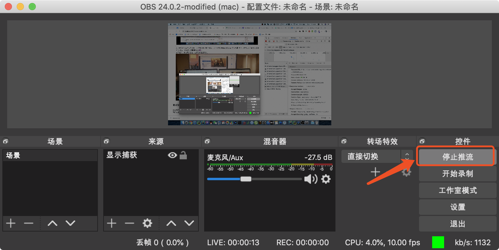
- obs推流失败。点击推流后程序未响应，数秒后提示无法连接服务器。请检查设置服务器地址是否正确，还不行的话可能服务端有问题🤨，请联系我。
- obs推流不断在推流成功和失败状态下切换。说明有人正在推流，被挤下去，过段时间后再试。
- 视频不能涉及政治、黄色。

---

## 介绍
> SRS/3.0，OuXuli，是一个流媒体集群，支持RTMP/HLS/WebRTC/SRT/GB28181，高效、稳定、易用，简单而快乐。  

[github srs](https://github.com/ossrs/srs)
作者是国人，从项目文档可以看到作者深耕直播行业数年，长长的update list，是个非常认真的人，让人佩服。
## 场景: 
- 直播和视频资源站。视频自互联网出现以来经久不衰，多感官的信息输入是最优质的媒介。从早年长视频资源站优酷土豆爱奇艺，到2016年斗鱼游戏直播，
到2017年-2019年短视频抖音快手淘宝直播，到2020年初疫情期间钉钉直播授课、抖音直播。随着技术成熟，网络带宽、手机硬件环境跟上，产品创意层出不穷，
从明星到素人，人人都在玩直播。
- macOS屏幕分享给多台windows授课。  
    这是我个人遇到的一个场景，原以为是个简单的需求，结果发现没有一款软件好用，**低延迟是最大难题**。下面是踩过的坑:  
    - InletexEMC是windows平台的局域网同屏软件，之前公司一直在使用。这款软件动态画面例如滚动屏幕清晰度自动降低至马赛克画质，静态画面画质却不错能看清代码，
      延迟大约在0.5s可以忽略不计，契合授课需求。刚开始使用这个软件时感觉虽然可用但界面年代久远，也许有更好的。但到后面发现没有超过这个软件的。
      查了下，它基于windows自带的mstsc远程控制协议，因此在windows平台效果很好延迟低，但没有macOS版本。  
      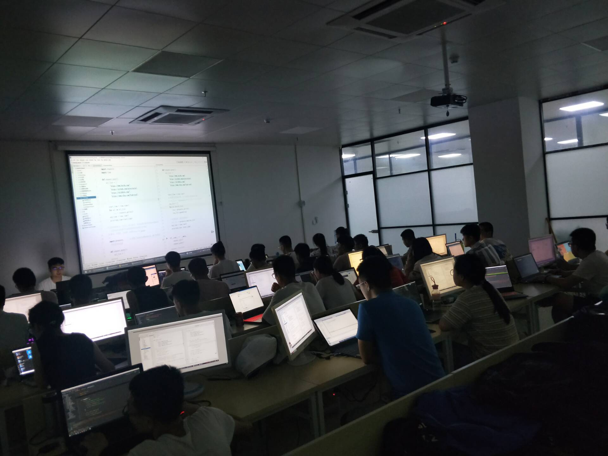
    - TeamViewer。知名远程控制、会议软件。局域网下免费、较为清晰、延迟1-2s可接受，唯一缺点需要手动禁止每台下位机控制上位机的权限。几十台下位机每天点一遍不可行。
    - VNC。macOS自带服务，易于开启，单台下位机延迟2s。缺点过于清晰、高上传带宽10MB/s每台下位机，几十台下位机后上传带宽达到局域网设备极限70MB/s，延迟也增长至8s。
      又尝试了单独的vnc软件，调低画质，但缺点一是同TeamViewer下位机掌握是否可以控制上位机的权限，一旦有一台下位机没设置好就会导致上位机鼠标🖱️乱窜无法授课，上位机无法设置。
      二是延迟同样高，查了下是免费开源协议的自身缺陷。三是上位机切换工作桌面就会卡死。  
      但vnc协议也有用武之地，在一些医院🏥、高铁站🚄看到的信息提示屏就用的vnc连接。
    - xxx会议软件。vnc、rtmp等开源软件套皮且收费。
    - nginx-rtmp插件。nginx很多程序员都用过,网上教程中的一种主流做法，但这个插件的git仓库已经好几年没更新了，不太放心。
    - webRTC。让人耳目一新的浏览器新技术，通过浏览器就可以控制操作系统分享屏幕🖥或录制⏺屏幕很神奇，我也期待未来web技术一统江湖。
      大概原理是️p2p连接，跨平台，低延迟不到1s，上位机可以选择是否允许下位机控制自己。
      完美符合需求但缺点：最多支持10个下位机，不能调整画质，相关开发资料极少，软件支持bug chrome76即使开了权限也在macOS10.15.0上不可用。  
      效果视频(不清晰将就看)：  
      <video src="./videos/webRTC.mp4" type="video/mp4" controls loop muted></video>  
      想尝试的访问[webRTC在线demo](https://www.webrtc-experiment.com/screen-sharing/) 。
    - 最终选择了srs。延迟1-2s，勉强能用。
    
    结论：局域网直播的需求太小众也无商业价值没人研究，让公司购买投影仪才是正解✅。没投影仪的情况下再考虑自建srs服务。

## 服务端自建教程
无，因为:
- 我只是部署现成开源项目，想自己尝试的可以直接看作者文档。但你可以从本文客户端测试中了解个大概。  
- 低延迟、不依赖flash的技术正在出现。虽然 本demo中低延迟推流协议依赖flash、设置chrome麻烦、client.html中只有老版本的video.js支持rtmp；
  flv协议能直接播放但延迟比rtmp高；webRTC不成熟。但预期新技术正在出现和成熟。
- 商业需求建议直接使用云服务厂商的接口，一条龙服务。直播算法只有大公司和这方面垂直领域的公司才搞的动。自己搞成本太高。  

如果你为了学习想自建srs服务，个人建议:  
1. 搞清相关协议名词。否则看不懂各类教程。  
阅读一圈文章后唯有这篇说的清楚  
⭐️[理解RTMP、HttpFlv和HLS的正确姿势---简书](https://www.jianshu.com/p/32417d8ee5b6)
2. 先阅读[github srs](https://github.com/ossrs/srs)仓库首页README.md的usage部分，先不要看其它细节文档。  
在linux虚拟机或自己的服务器上尝试部署。  
首先根据入门文档尝试git clone 代码，克隆完项目一条命令就可以启动服务。  
作者提供的web页面功能较多。一开始你可能不知道🤷点哪里。建议启动服务后参考本文流程和client.html的代码自己做客户端。  
成功后尝试项目目录下预先提供的不同配置(例如低延迟)，不同流协议(例如flv)，重启服务。
3. docker方式  
本demo使用这种方式，版本3.0。  
[github ossrs/srs-docker](https://github.com/ossrs/srs-docker#srs3)  
[dockerhub ossrs/srs](https://hub.docker.com/r/ossrs/srs)
4. 后续玩法
(未尝试)手机端直播、互动，跟成熟产品很像了。  
[github SunLiner/MiaowShow](https://github.com/SunLiner/MiaowShow)

完。