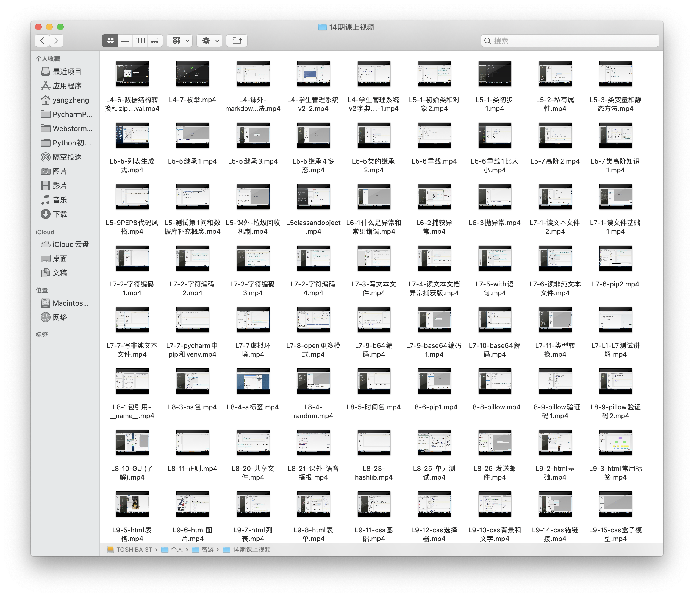
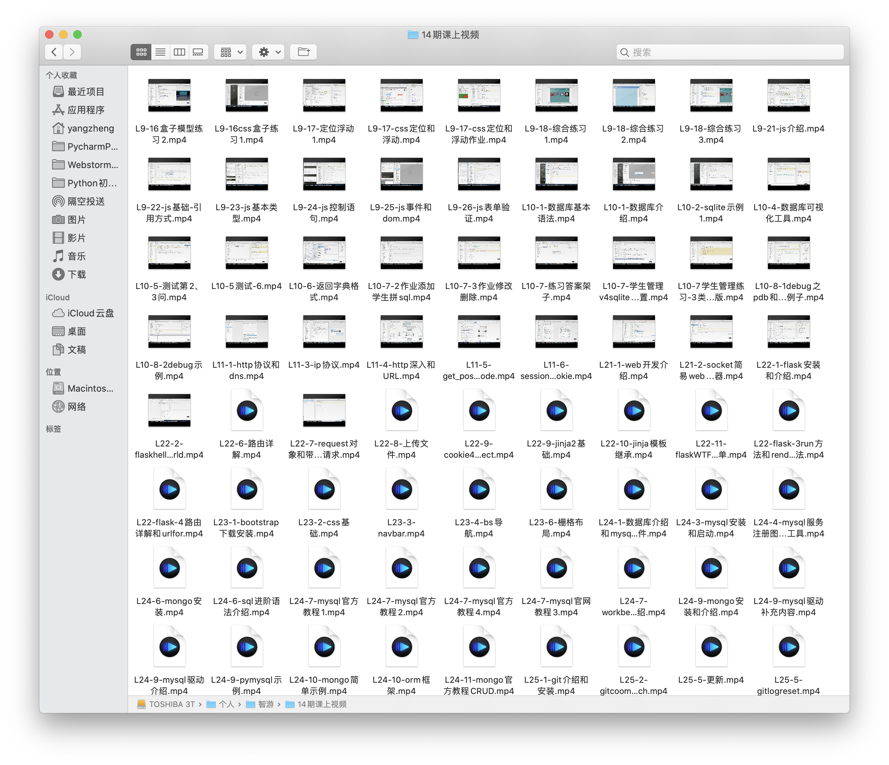
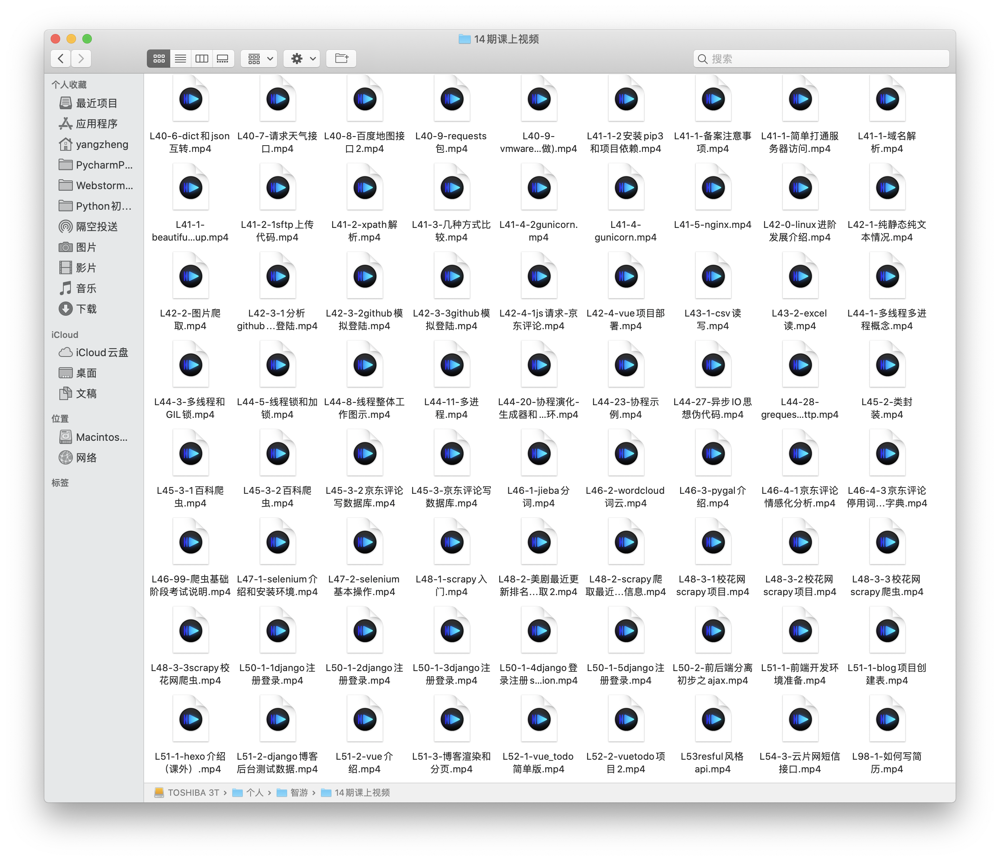
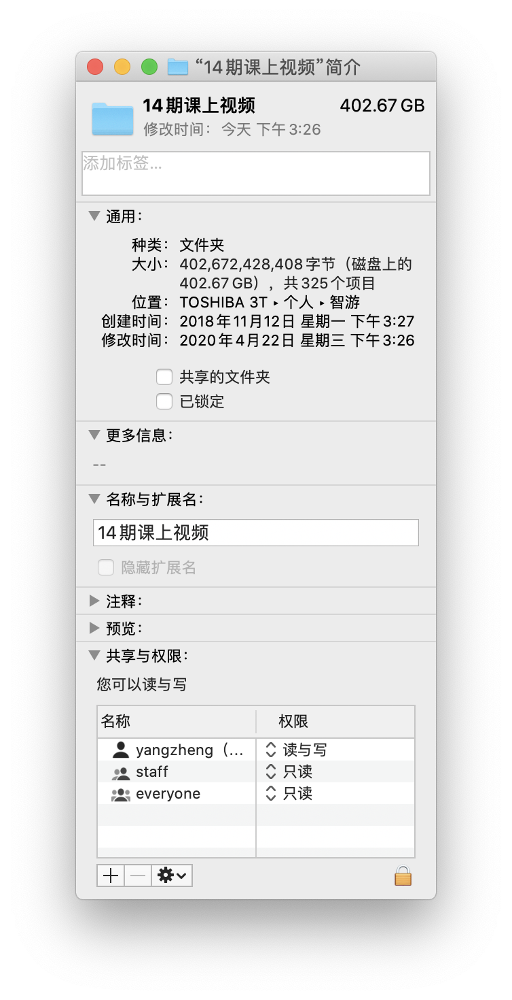

完整线下培训班四个月的视频
===
(培训行业看法，内幕，讲师职业的难与易，学生看法，歧视和市场，内容太多本文不讨论。本文只是我的工作成果总结。)
## 教案
[教案](todo)

## 视频
此视频不对外提供。仅用做个人总结。

起初，因为入班学生进度不同，一个班正式开始前的两周断断续续有学生进入，进度不同。为了避免重复进入导致我重复讲解，录制视频并分发给新同学。
后来，经常有学生请假，为了防止请假的学生拉下课程，我仍然录制，学生回来后再让他拷贝走。再然后，录制留个纪念吧，过二十年后回味从前每份工作都是无怨无悔的😄。
加上软件操作简单，课前、下课点几下就好，就一直坚持到了最后。
不知觉留下了300多400多G的录制文件。也挺有成就感。  

不对外提供因为:
- 带线下收费班时录制。不应该对外分发，只有公司和那个班的学生才有权查看。
- 视频底噪较大，清晰度一般，不然一天就应该有好几G的文件产生。
- 一天视频几个小时，包含讲课、闲话、甚至下课和自习。看这个自学效率肯定不高。
- 第一遍线下教学，觉得还有很多改进之处。
- 中途目录重命名过，顺序和命名有些是乱序的。
倒也不绝对，如果你实在卡在某个地方，我可以传给你关于那个知识点的几集。

录屏工具推荐`icecream recorder`，视频录制⏺️是一个常见需求。然而  
- 录像大师， xx录屏等。颜值低，容易含广告，包含多余功能，需要授权。
- win10自带，只能录制游戏。
- obs，开源免费但操作设置复杂。
- icecream recorder。简单易用。
