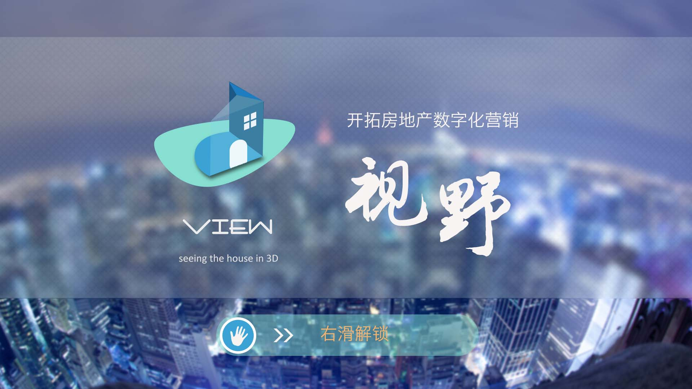
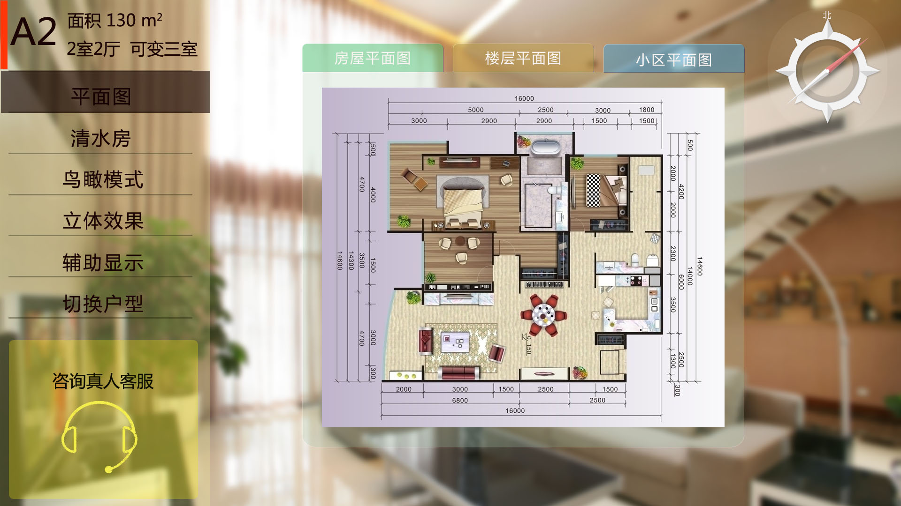
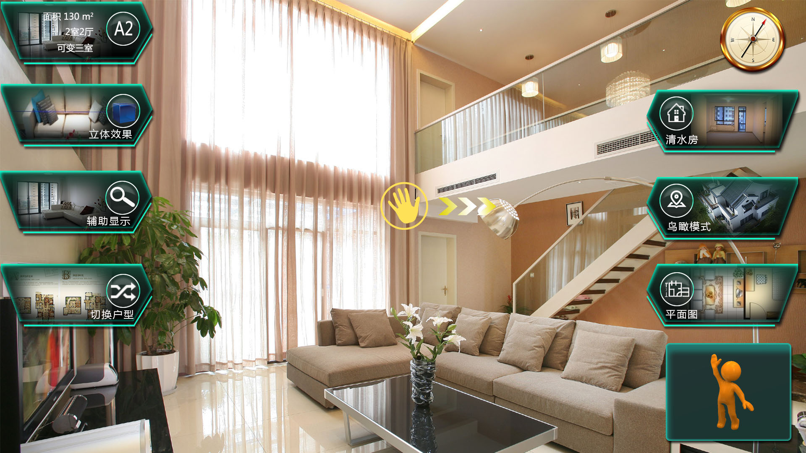
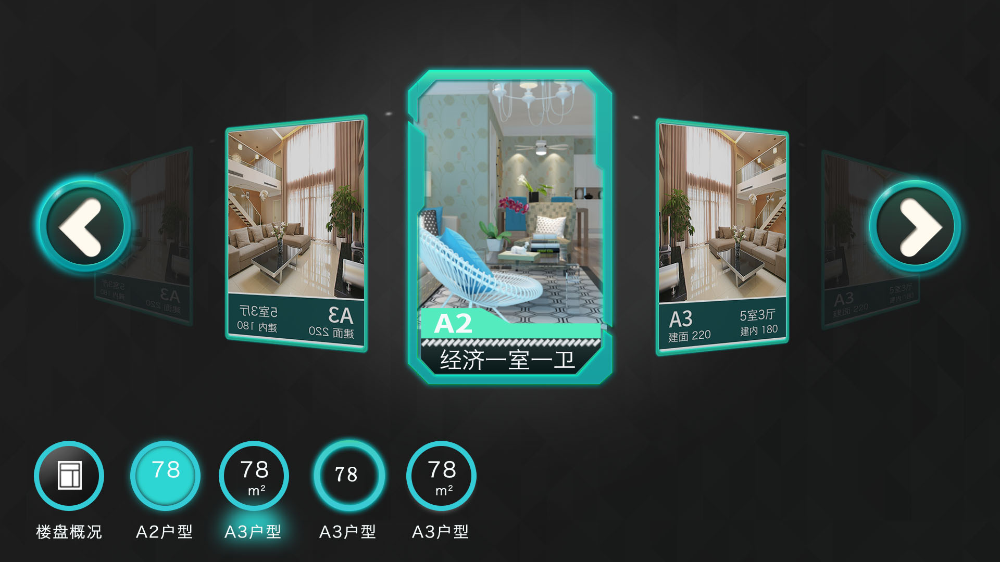
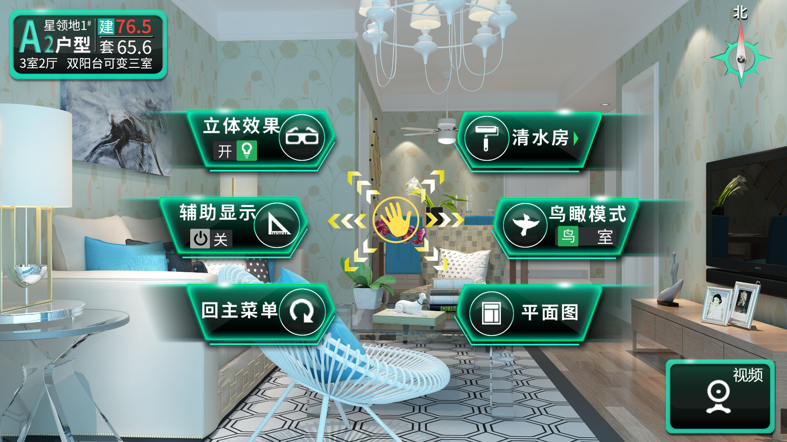
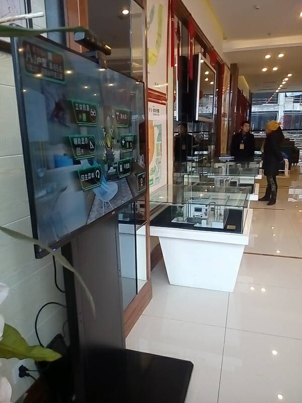
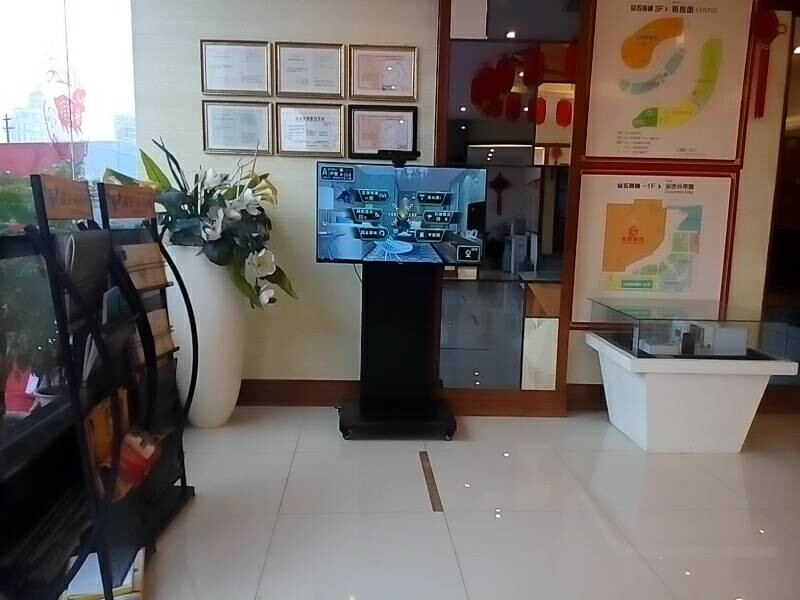
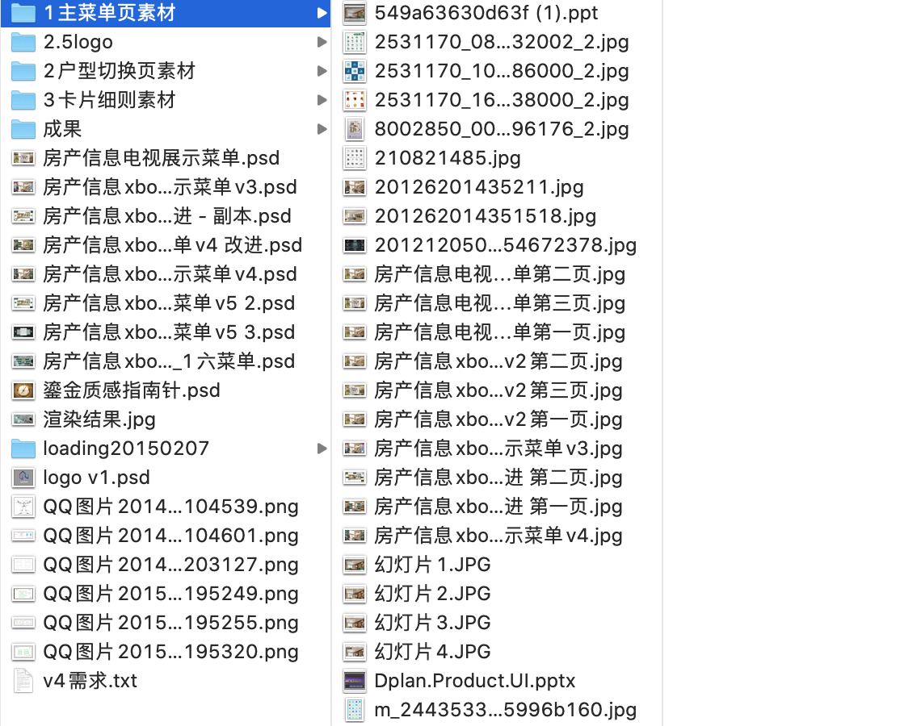

基于xbox游戏机体感检测的看房系统
===
2014年底自学完UI时面试了家公司没回复，想是不是因为没有实际工作经验，于是在威客类网站'猪八戒'上尝试。因为比稿平台上面的生态并不好，因为做demo也是有
很高成本的，所以上面充斥着广告和简单回复。我认真分析了几个千奇百怪的需求并回复设计小样，最终联系到了一些。  

下面说本文这个需求。对方的需求是逻辑清晰的手稿和文字描述。因为我有编程背景、打字快，跟对方技术经理交谈甚欢。据对方说，
之前找的一个女孩不理解xbox🎮体感😓(没办法，她应该没听说过就像我谈恋爱前没听说过mac、ysl)、不理解需求。聊天中印象比较深的一段是：  
对方说，我面试了很多编程开发新人，问windows上的软件安装目录经常有个bin📁文件夹，这个文件夹为什么叫bin，我最近一年问了二十个人，只希望对方
答出binary这个单词，但没一个人会。而你会😳。(我也只是答出了里面有可执行文件、程序入口、java字节码之类的，对二进制和为什么要编译理解没现在深)。  

确认合作后，开始不断的修改交付，因为是实际、有趣的需求，我也为了积累工作经验当作提高，即使报价很低也做了一堆稿子。当平台发布的需求终于做完后，
对方很满意："我看你电视端界面设计的不错，ipad和手机端也交给你，你随便开价"。😄 谢谢对我的认可，但我也不敢随便开啊，因为第一阶段价格很低。
当时不够成熟，不会解释，也不敢要价，恰逢被老爸批不出去工作自己接活不稳定😭，就婉拒了。。后来还是比较后悔的，当时还洽谈的有其他活，险些成功过上soho生活。

xbox、ps4并不像现在的switch这么流行，只有水货，少数玩家在玩。当时智能设备、树莓派、摄像头ai还都没兴起（也可能是我当时level没接触到），现在比较
好奇他为什么不用开发版加摄像头。当时也问过，对方说擅长C#技术栈。

## 效果图
设备为电视📺  
首页logo有借鉴，背景是纽约市照片有版权。当年比较宽松，现在UI行业的应该非常注重版权问题。  
  
主操作页面，用户挥手🙋，摄像头监测到后移动光标到不同目录。  
前几版稿子作废  
  
  
切换页  
  
最终稿。背景图是甲方的室内建模。  
  
  
最终在电视上的效果，有视频(没放上来)，看到设计结果成为成品很高兴😊。  
  
  
psds  
  

## license
禁止转载。