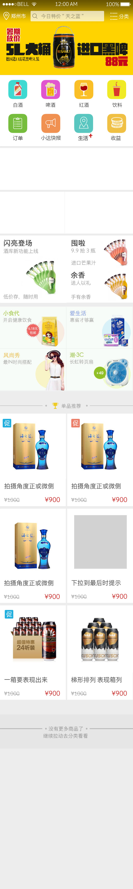
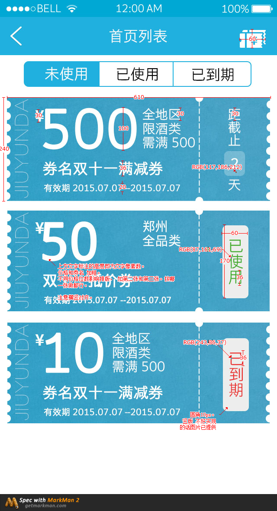
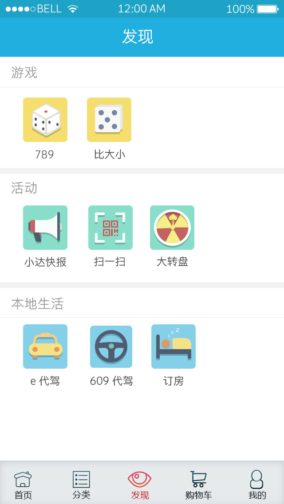
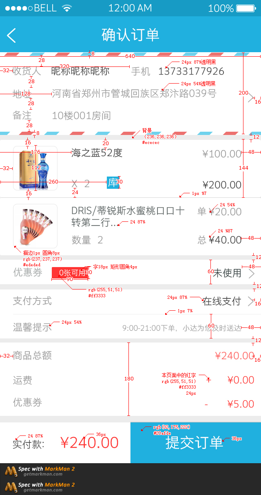
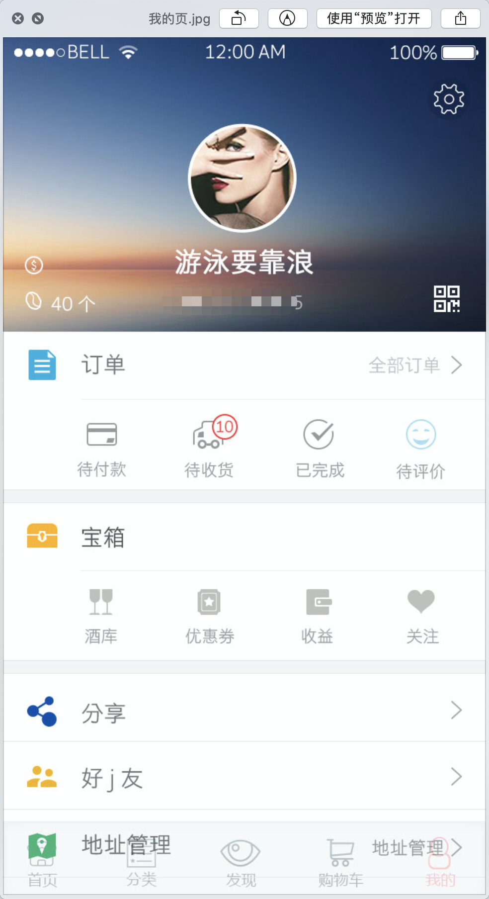
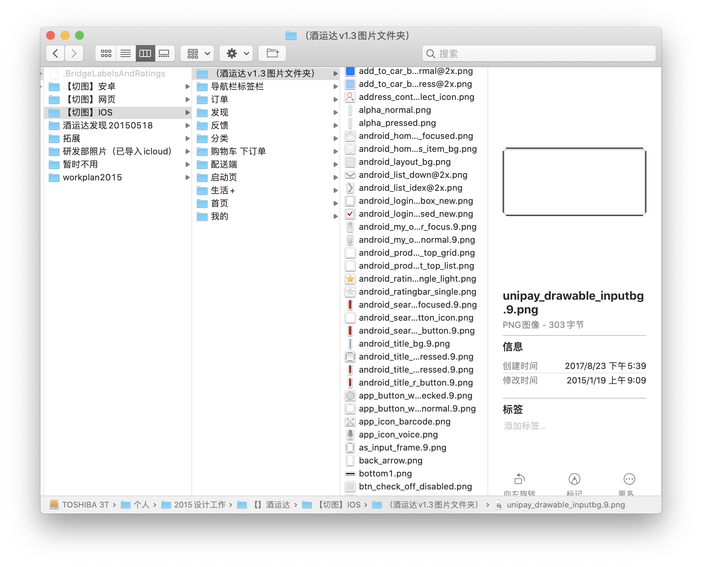
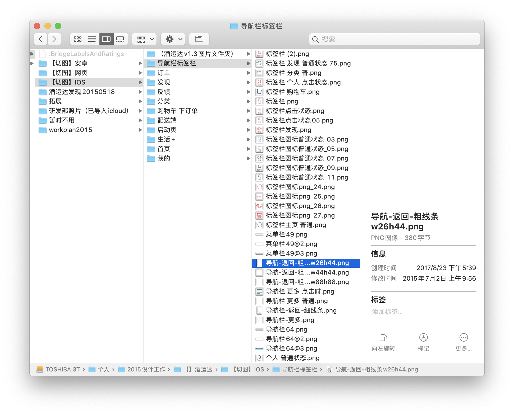
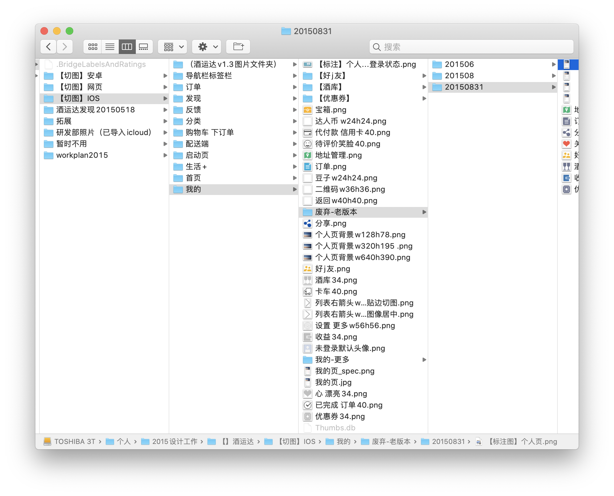
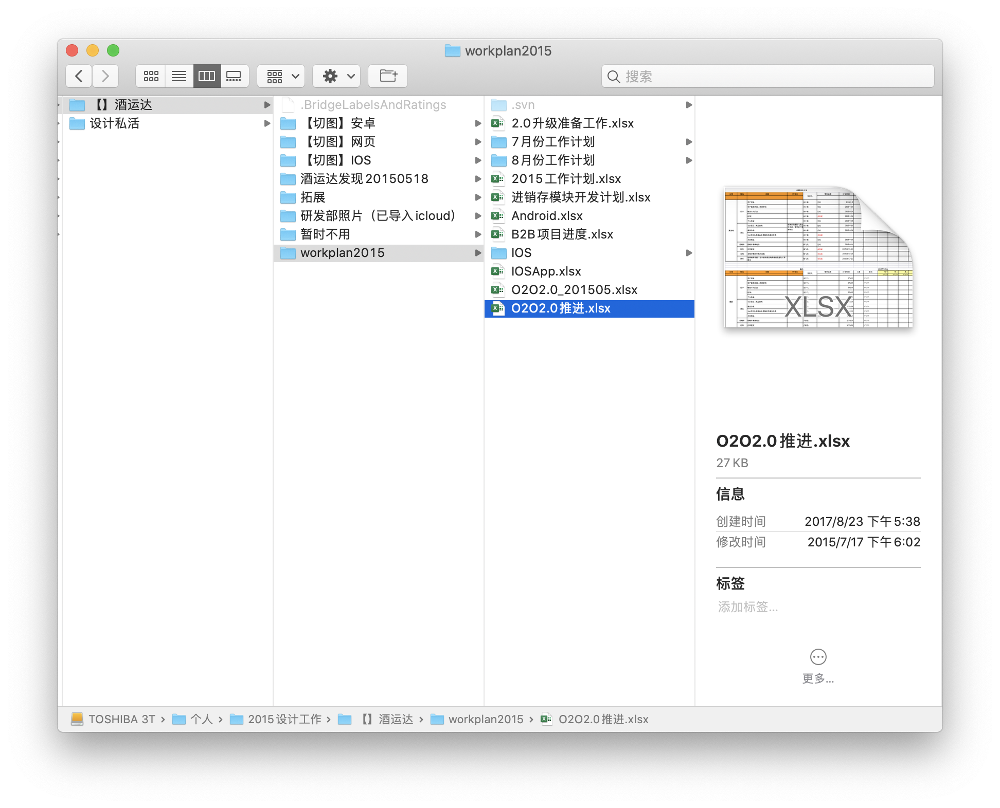

郑州酒运达app
===
## 回忆当初
2015年我的UI生涯主要在这家公司渡过。酒类垂直电商，有一些仓库配送点，在河南搞铺贴加盟，软件开始模仿京东，然后我开始负责界面重构。  
难度主要在：  
- 现实工作，虽说坚信自己是专业的、要坚持自己的设计并说服他人，但领导的意见也不能不听。不同于在设计论坛上发表个人作品，实际作品是受多方面影响的，
例如领导意见、开发实现难度和开发跟效果图的偏离。
- 📱手机开发刚开始火起来，官方sdk还是开发框架对多分辨率支持并不好。同一个图标需要给出多个尺寸，多个安卓手机需要选几个代表尺寸，安卓.9图等。
而彼时也没有sketch这样的UI专业设计工具，photoshop甚至只能单张保存，原公司平面切一个各种尺寸图标半天。还好我尝试了最新版ps cc版本自带的导出为功能。
平时除了设计就是标注，与安卓、IOS开发交流，确保最终效果。
- 行业初兴，很多事没有流程，每天看设计论坛，认真标注，尽量为团队带来最专业的UI支持。

后来高层变动，来了位身携几百万阿里股票的高管，用二十分钟来自陌生人的聊天就俘获了老板的心（论个人能力重要性）。把原技术部主管和团队排除掉了。公司蒸蒸日上融到了钱，在他的带领下确实也有不少新气象。他野心很大说要做郑州数一数二的互联网公司。
他把我留下，升为设计组长，招了一队新开发和几个UI。但我并不开心，升职了却本来要涨的工资不涨了，虽然面试新人但没什么决定权，最终一个人同时干几个新项目还要带新手，累到食指痉挛。公司管理上也越来越无人情。
后来才知道他是运营出身，并不懂开发，只知道催进度。对他也没那么敬仰了。  
我选择了离职，但郑州愿意花高价找画图的公司并不多，或离家太远（地铁2号线还未开通），
我也自觉非美术🎨出身（虽然小时候练过素描），不能随心所欲创作，模仿终究感觉不自信。虽然挺喜欢做设计，但最终放弃了行业上升期的UI，**回到编程**。
这段经历并不吃亏，对于后面做软件全栈是非常有利的，界面直接自己控制。

过后两年，我依然记得友好的老团队同事，不时关注着这家公司，却传来老板跑路的新闻，网站也不能访问，看来产品已经关闭了。。

## 效果图
一些页面。  

封面logo不是我做的，公司存在时就有了，虽然有点丑，不过公司logo更改很麻烦一般不修改。  
页面中的每一个图标需要画，为了控制整体感，无法完全依赖iconfont这类网站。然后导出各种组件、甚至背景、分割线和不同尺寸。产生了文件和适配工作。
那几年手机适配是一大难题。  
现在的行业得益于手机主流屏幕分辨率统一、一些自适应的UI框架，不需要这么麻烦了。  

