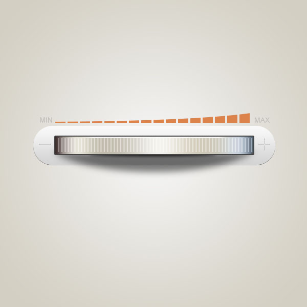

一本app基础教程中的所有练习（临摹）
===
2013毕业时正直互联网风口时代，大学计算机专业和培训班出来的java非常好找工作。编程人才供给上去之后，智能手机📱、移动互联网App开始大火。
这时候公司发现，软件不光要能用，还要**好看好用**。而当时的传统软件公司后端从产品干到测试，互联网公司只分化到写html/css的前端。UI和UX在市场催生下横空出世。  

2014年UI设计行业初兴，别说郑州，一线城市都新，网上搜不到书籍📚、视频教程、培训班刚刚开此专业但花钱啊、找不到人交流。搜索一通资料后找到了免费教学的**Y总**，这个人
能力挺强，讲课也有趣，我挺佩服他，但课程偏理论。除外就是UI中国、站酷这些平台。遵照平台，正确的审美是可以培养起来的，但对如何学起来，熟练工具，找工作仍是非常未知的。  

想找本书系统学一下，但一共没搜到几个结果，买了两本，除了书的大名，跟UI并无关系，内容全是影楼照片修图平面设计那一套，靠UI的名号捞金而已。之后几个月继续不时找资料，
终于找到一本新出两周的书《app手机界面创意设计新手通》的书，一看内容，第一本真正的UI书终于出现了。这本书很厚，讲的非常细，一个图标几十步骤，连颜色代码都给出了，
你就是ps刚接触也能学的会，或直接阅读后面某节也能直接做。这本书的好处是，示例多，图标也是扁平或国外作品风格，整体审美方向是对的。
不足的话，就是这本书的第一章比第三四章难，练过几个之后不要看步骤自己临摹会进步快点。
感谢这本入门书，带我熟练PS、理论实践结合、在未知的开荒过程中指明了方向、最终带我入门，虽然它一直没有大卖。  

2020年，如果你现在要学的话，推荐再选选，这么多年过去肯定有更优秀的教材出现。B站上有许多视频教程。也有很多培训机构的视频教程流出。现在的学习环境无疑好很多，
但要求也提升很多。自学不易，与各位自学者共勉。

## 截图
这本书我最喜欢这个按钮  
  
  
ins  
  
  
绳子和褶皱  
  
看MV的音悦台已经倒闭了  
  
  
iphone5时代，   喜欢歌手YUI  
  
  
几例注册登录  
  
  
  
  
  
  
  
  
  
  
安全软件一小套  
  
  
  
  
  
  
  
  
🍃是现成素材  
  
  
  
💦是钢笔工具画的  
  
  
  
  
psd文件。  
  
