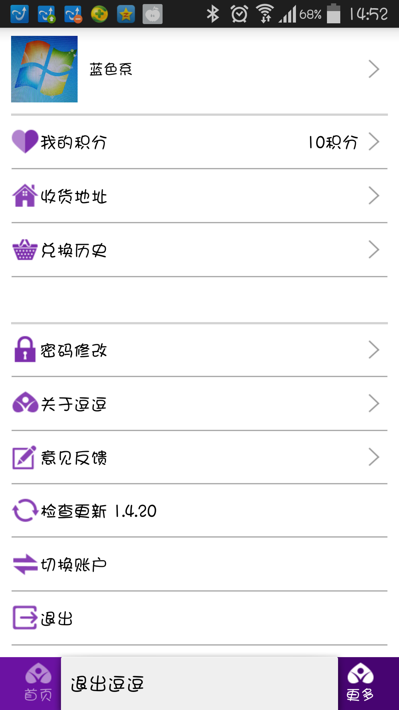
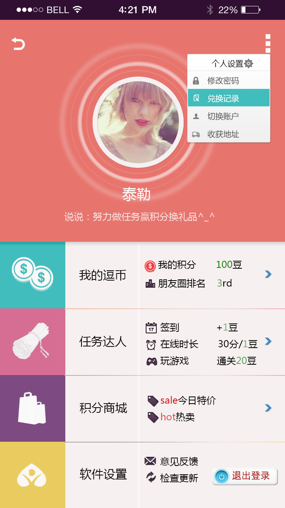
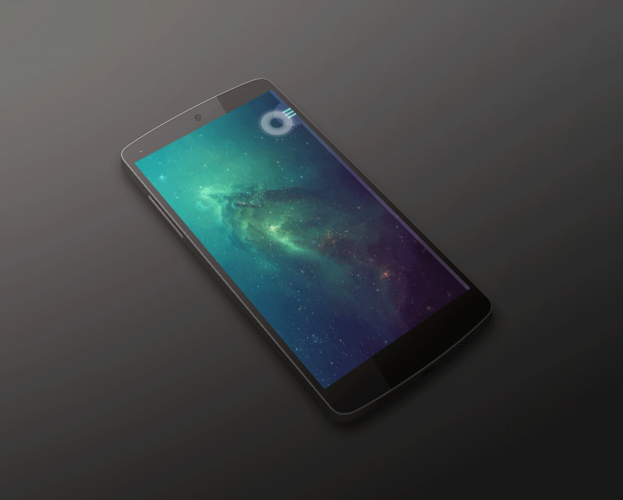
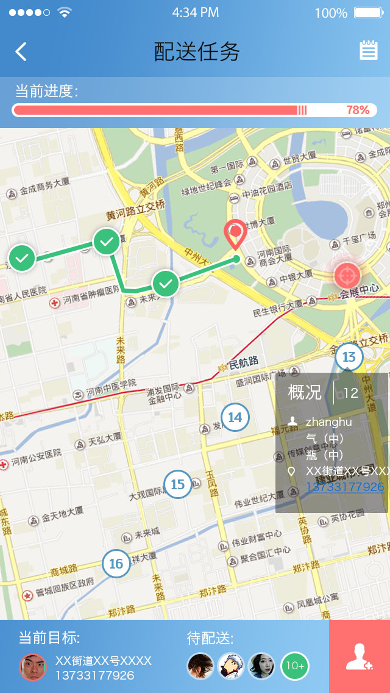
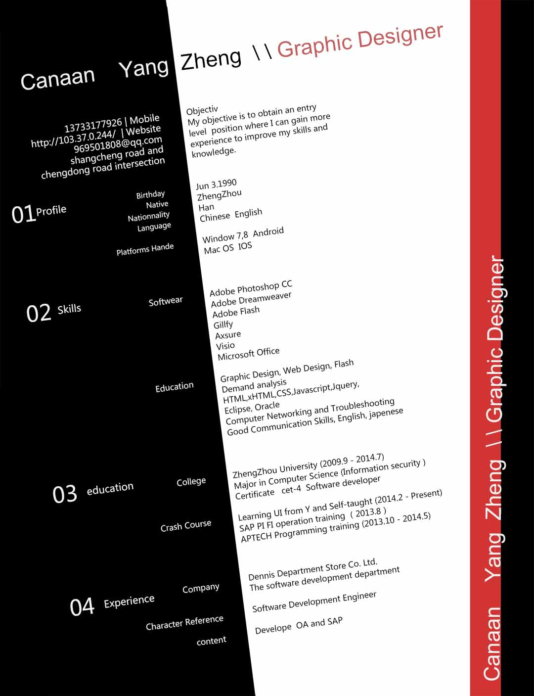
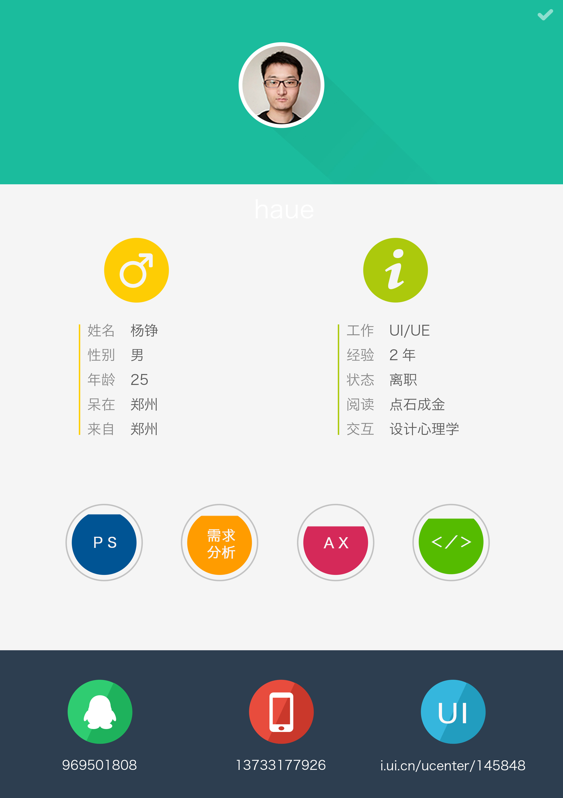
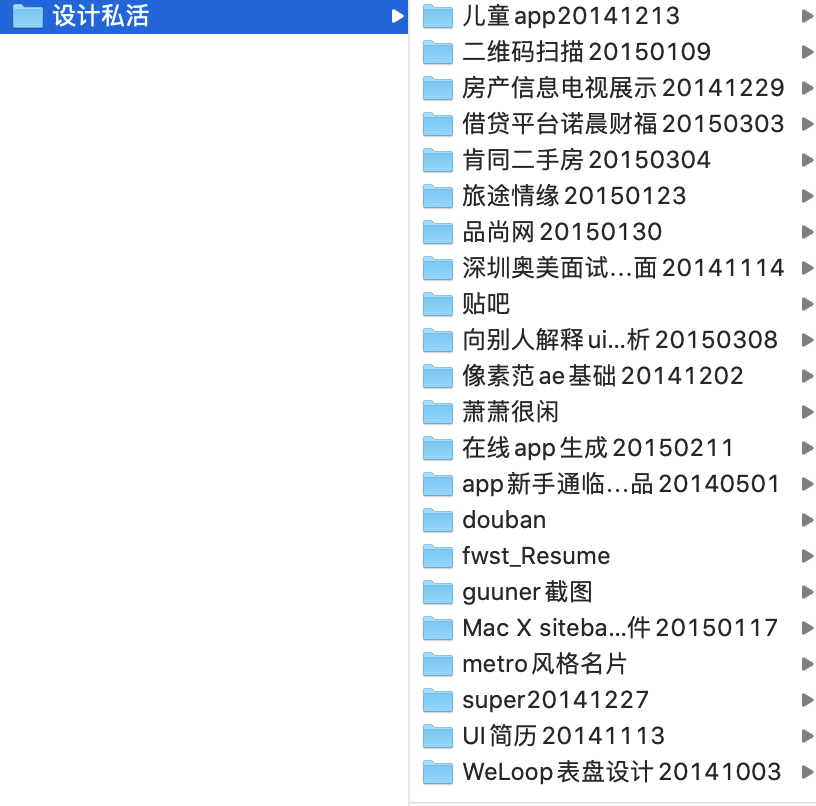

其它UI零散作品
===
（封面图来源论坛，与本文无关。）  

其它作品访问[我的UI中国主页/canaan_ui](https://i.ui.cn/ucenter/145848)  
现在2020年回头看2014～1015的一些作品太稚嫩、太丑了，就不放到个人站了。下面是挑选出的几张，虽然也有些问题。移动硬盘里的一些半成品也不会放。  

## 截图
智能手表表盘设计比赛。像素设计的有问题边缘糊了，另外任天堂的角色有版权不能随便用。  
  

2014年末刚开始找UI相关工作，面试一家公司修改页面，一位没有露面的前端技术头目托人事之口质疑了 我bootstrap模板改的在线简历不是手写代码，
开发改模板怎么了，而且我面试的是纯设计又不是前端，在线网站是为了表现有编程背景。最后说考考我改个页面，我说其它作品已经可以表现，一个页面需要很长时间，并且近期忙于面试。
最后还是做了，做了一天发对方邮件没回复😠。而且对方不像骗稿，只是无知，哎。  
修改前（不怪他们，那年的app基本都长这样。）  
  
修改后，借鉴了其它优秀作品，当然还是有些问题，字在实际设备上太小。  
  

重型工具AE，当时会一点算加分项，现在看下面的太简单。现在行业的话，都要求会，并且有更轻量的专门做UI的动效工具，作品也更好看。
  
快递页，借鉴了其它优秀作品，后来美团火了。此设计稿早于京东和美团出现相关页面。还做过一个九宫格，后来支付宝变成类似页面。我算是抄对了方向。。
所以设计先行，其实软件的发展遵循设计网站如dribbble、UI中国上的作品。  
  
2015年时的简历，体现了UI从业者身份，买了个打印机🖨️自己印了出来。人事看到时眼前一亮。  
  
  
很多私活，一些是洽谈中的半成品，认真对待每一个机会，成交不容易。锻炼了沟通能力。不过当时还不够成熟，不敢报价。
  